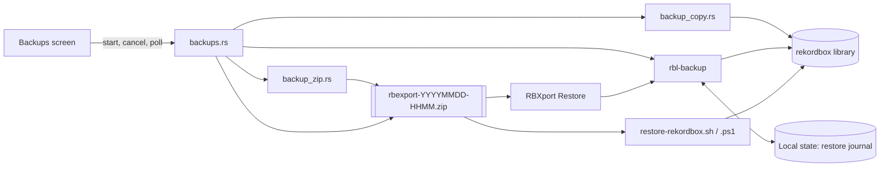
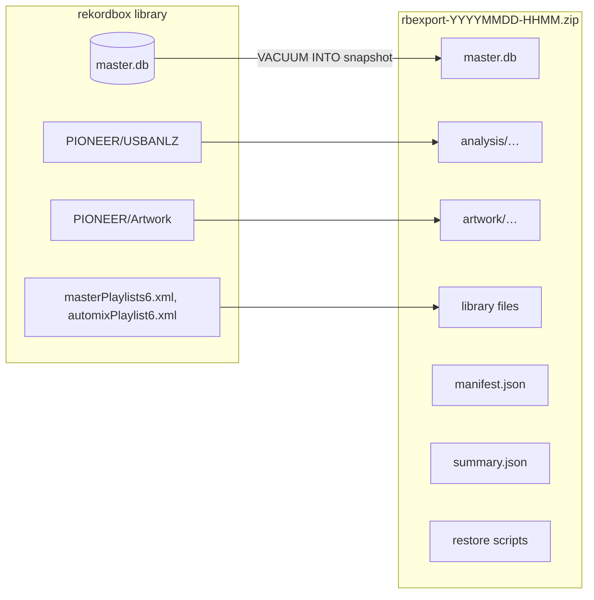
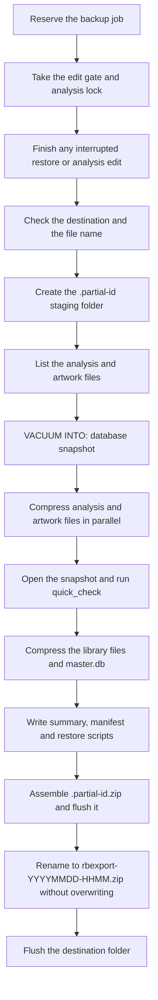
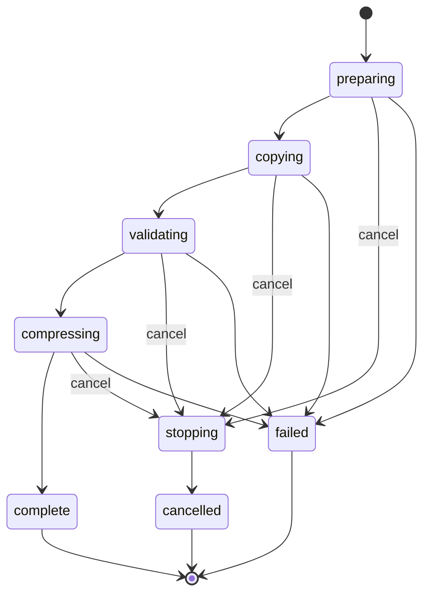
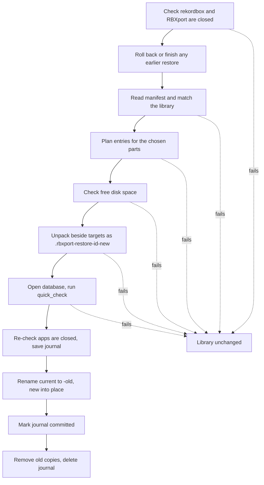
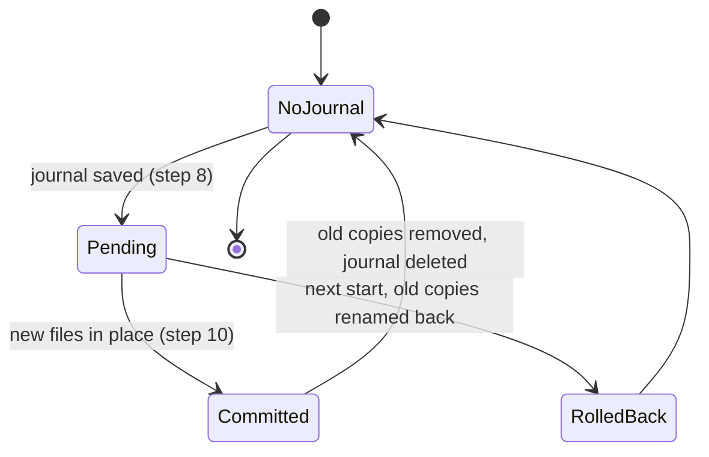

# How library backups work

[Documentation](../README.md) · [Backups user guide](../user/backups.md)

This reference describes how RBXport creates a library backup, what the
archive contains, how a backup is restored, and why each part works the way
it does. The user guide covers the Preferences screen; this document covers
the implementation behind it.

| Area | Code |
| --- | --- |
| Creating, listing and deleting backups | `src-tauri/src/backups.rs` |
| Parallel file copy and compression | `src-tauri/src/backup_copy.rs`, `src-tauri/src/backup_zip.rs` |
| Embedded restore scripts | `src-tauri/src/backup_restore_scripts.rs` |
| Rekordbox Data size estimate | `src-tauri/src/backup_sizes.rs` |
| Archive format, manifest, summary, restore and journal | `crates/rbl-backup/` |
| Restore app | The separate [RBXport Restore](https://github.com/chrisle/rbx-restore) repository |



## What a backup contains

A backup is one standard ZIP file named `rbexport-YYYYMMDD-HHMM.zip` in local
24-hour time. Any ZIP tool can open it.

| Entry | Source | Purpose |
| --- | --- | --- |
| `master.db` | A snapshot of the library database | Tracks, playlists, My Tag, ratings, cues and history. Still encrypted with the library's key. |
| `analysis/…` | `PIONEER/USBANLZ` | Beat grids, waveforms, cues, phrases and vocals. |
| `artwork/…` | `PIONEER/Artwork` | Album art and thumbnails. |
| `masterPlaylists6.xml`, `automixPlaylist6.xml` | Beside `master.db`, when present | Sync Manager selections and the Automix playlist. These live outside the SQL database. |
| `manifest.json` | Written by RBXport | The `master.db` path the backup came from, creation time, logical byte count, and which library files it holds. Restore depends on this file. |
| `summary.json` | Written by RBXport | Track, playlist and cue counts and per-category sizes, so a person can recognize the backup before restoring. |
| `restore-rekordbox.sh`, `restore-rekordbox.ps1` | Written by RBXport | Standalone restore scripts for macOS and Windows. |

Music files are not included.



Older backups can differ: manifest version 1 predates artwork and library
files, some older archives carry `master.db-wal`, and backups made before
RBXport 0.18.0 have no `summary.json`. RBXport Restore handles all of these.

## Creating a backup



If any step fails or the backup is cancelled, the staging folder and the
partial ZIP are removed and no backup appears in the list.

### 1. Starting the job

`backups::start` marks a job as running before it spawns the worker, so two
windows cannot start two backups. The worker runs on a blocking thread. It
reports progress (phase, bytes copied, bytes expected, and the current file)
into shared state, which the frontend polls every 500 ms. The phases are `preparing`,
`copying`, `validating`, `compressing`, and then `complete`, `cancelled` or
`failed`.



Cancelling sets the phase to `stopping`. The next progress callback sees that
and returns a cancellation error, which unwinds the pipeline at the next file
or 1 MiB chunk. A panic in the worker is caught and reported as a failed
backup.

### 2. Locking out RBXport's own edits

The backup holds two locks for its whole run:

- `edit_gate`, which every RBXport database write takes. RBXport cannot change
  the database during a backup.
- `analysis_write`, which grid and analysis edits take. RBXport cannot change
  analysis files during a backup.

Before copying anything, the backup completes or rolls back an interrupted
restore (the restore journal) and an interrupted analysis edit (the
analysis journal), so it never captures a library in the middle of one.

Backups do not require rekordbox to be closed, and they still run while the
library is read-only. The locks only stop RBXport. See
[Running while rekordbox is open](#running-while-rekordbox-is-open).

### 3. Checking the destination

The destination is the Default backup folder from Preferences, or the local
state folder when none is set (see [Local state](#local-state)). RBXport:

- creates the folder if it does not exist, flushing each new directory;
- refuses a folder inside `PIONEER/USBANLZ` or `PIONEER/Artwork`, because the
  backup would then copy itself;
- refuses to run if `rbexport-YYYYMMDD-HHMM.zip` already exists for the
  current minute. An existing backup is never overwritten.

### 4. Staging

All work happens in `.partial-<uuid>/` inside the destination folder. The
leading dot and the `.partial-` prefix keep it out of the backup list.
Staging inside the destination folder means the final step is a rename on
the same filesystem rather than a cross-drive copy.

### 5. Listing the analysis and artwork files

`TreeCopyPlan::prepare` walks `PIONEER/USBANLZ` and `PIONEER/Artwork` once
and records every file and its size. Symbolic links and special files stop
the backup with an error. The same list is used for copying, so files
added after this point are not included. The sizes plus the database size give the progress total.

### 6. Snapshotting the database

RBXport opens the library read-only and runs:

```sql
VACUUM main INTO '<staging>/master.db'
```

This writes one consistent, standalone copy of the database. The copy uses
the same SQLCipher encryption and key as the original. The counts for
`summary.json` are read from the live database right after the snapshot. The copy is then flushed to disk. See
[Known issues](#known-issues) for a Windows bug in that flush.

Why RBXport snapshots the database this way instead of copying the file is
covered in [Database snapshot instead of a file copy](#database-snapshot-instead-of-a-file-copy).

### 7. Compressing the analysis and artwork files

Each analysis and artwork file is compressed into its own one-entry ZIP
(`<name>.zip`, Deflate level 9) inside the staging folder. Worker threads,
one per available CPU, take files from a shared queue. Progress updates go
through a bounded channel to the main backup thread, which reports them and
checks for cancellation. When one worker fails, the others stop, and the error
is returned only after every worker has finished, so the staging folder can
be removed safely.

Each compressed piece is flushed when written. After all workers finish, the
staging directories are flushed from the deepest up.

### 8. Validating the database copy

The staged `master.db` is opened with the library's key and checked with
`PRAGMA quick_check`. If it does not open or the check fails, the backup
fails. The `master.db-shm` file that opening it creates is deleted.

### 9. Compressing the library files and the database

`masterPlaylists6.xml` and `automixPlaylist6.xml` are compressed into the
staging folder if they exist. The staged `master.db` is then compressed in
place, and the uncompressed copy is deleted.

### 10. Writing the summary, manifest and scripts

- `summary.json` gets the counts from step 6 and the sizes of each kind of
  analysis data (beat grids, waveforms, cues, phrases, vocals, other),
  artwork and the database.
- `manifest.json` records the library's `master.db` path, the creation time,
  the logical bytes copied, and which library files were present.
- The two restore scripts get the library's `master.db` path as their
  default target.

Each is written through `durable::write`: written to a temporary sibling,
flushed, then renamed into place.

### 11. Assembling and publishing the archive

`backup_zip::assemble` builds `.partial-<uuid>.zip`. The compressed pieces are
raw-copied into it under their final names, so nothing is compressed twice.
Metadata and scripts are compressed directly; the shell script gets mode
`0755`. The finished ZIP is flushed to disk.

The staging folder is then removed. The partial ZIP is renamed to
`rbexport-YYYYMMDD-HHMM.zip` with a rename that fails instead of overwriting,
and the destination folder is flushed.

## Listing and deleting backups

The Backups screen lists only files in the destination folder that:

- are named `rbexport-*.zip`, are regular files, and are not symbolic links;
- contain a valid `manifest.json`;
- were taken from the currently open library, judged by the manifest's
  `master.db` path.

A backup from another library, or one that was moved or renamed, is not
listed. RBXport Restore can still restore a moved or renamed backup with
**Choose ZIP…**.

Delete accepts only a file directly inside the destination folder whose name
matches a backup format RBXport has used: `rbexport-*.zip`,
`rbxport-backup-*.zip`, `library-*` folders or ZIPs, and `master-*.db` (with
its `-wal` and `-shm` files). Archives must also have a manifest that belongs
to the current library. After deleting, the folder is flushed.

## Restoring a backup

Restore lives in the separate RBXport Restore app. Its logic is in
`rbl_backup::restore`, which RBXport's tests also run. A restore:



A restore:

1. Refuses to start if rekordbox is running (outside test mode), if RBXport is
   running, or if RBXport has an analysis edit it has not finished.
2. Finishes or rolls back any earlier interrupted restore, and removes
   staged files a restore left behind before it saved its journal.
3. Reads `manifest.json` and refuses a backup taken from a different
   library.
4. Plans which entries to unpack from the parts the person chose: database,
   analysis, artwork, library files. An entry name that could escape its
   folder (`..`, absolute paths) refuses the whole archive. A part the
   backup does not contain is left unchanged.
5. Checks free disk space against the summary's sizes plus 64 MiB.
6. Unpacks each chosen part beside its target under a
   `.rbxport-restore-<uuid>-new` name. Every entry is checked against its ZIP
   checksum, and stored symbolic links are refused. Files and folders are
   flushed.
7. Opens the unpacked database with the library's key and runs
   `quick_check`.
8. Checks again that rekordbox and RBXport are not running, then saves the
   restore journal (`backup-restore.json` in the local state folder).
9. For each target: renames the current file or folder aside to
   `.rbxport-restore-<uuid>-old`, then renames the unpacked one into place.
   Restoring the database also moves aside any existing `master.db-wal` and
   `master.db-shm`, which belong to the old database.
10. Marks the journal committed, removes the old copies, and deletes the
    journal.

Before step 8, stopping or failing leaves the library unchanged. Once the
journal is saved, the next start of RBXport or RBXport Restore reads it: an
uncommitted restore is rolled back by renaming the old copies back, and a
committed one is finished by removing the old copies. While a journal is
pending, RBXport refuses to edit the library.



### Standalone restore scripts

Every backup contains `restore-rekordbox.sh` and `restore-rekordbox.ps1`.
After unzipping, either one restores the backup without RBXport or RBXport
Restore. The script:

- checks that it is in an extracted backup and that rekordbox is not running;
- asks for confirmation;
- moves the current database, `-wal`/`-shm` files, `USBANLZ`, `Artwork` and
  library files into a `.rbxport-before-restore-<time>-<pid>` folder beside
  the library;
- copies the backup's files into place.

It does not verify checksums or use the restore journal. On failure it
prints the rollback folder's location.

## Local state

`rbl_backup::state_dir()` is RBXport's backup state folder:
`<data dir>/rbxport/backups`, or the path in `RBXPORT_STATE_DIR` when that is
set. It holds:

| File | Purpose |
| --- | --- |
| `backup-restore.json` | The restore journal, while a restore is pending. |
| `analysis-journal/` | Journals for analysis edits in progress. |
| `backup-destination.json` | The Default backup folder setting. RBXport Restore reads it to list the same folder. |

This folder stays on the local machine even when backups are saved to
another drive, so recovery does not depend on that drive being connected.
Backups are saved here when no Default backup folder is set.

## Design decisions

### Database snapshot instead of a file copy

Copying `master.db` directly can produce a backup that is out of date or
corrupt:

- In WAL mode, SQLite writes recent commits to `master.db-wal` and moves them
  into `master.db` later. A copy of `master.db` alone can miss recent changes.
  Copying both files is only correct if nothing writes between the two
  copies.
- If anything writes to the database during the copy, the result mixes pages
  from before and after that write.

`VACUUM INTO` reads the database inside one read transaction. It sees one
consistent version, including commits still in the WAL, and writes that
version out as a single file with no WAL. In WAL mode, other writers can
continue during the snapshot without affecting it; in the other journal
modes they wait until it finishes. The output keeps the source's SQLCipher
encryption, so the backup opens with the same key. Free pages are dropped, so
the copy is usually smaller than the original.

A comment in `crates/rbl-db/src/write.rs` gives "rekordbox holds that file's
WAL" as the reason RBXport refuses writes while rekordbox runs.
[OBS] An installed rekordbox library's `master.db` reports `journal_mode`
`wal`, checked read-only with `cargo run -p rbl-db --example sql -- "PRAGMA
journal_mode"` on macOS (2026-10-07). WAL mode is stored in the database
file, so rekordbox uses it whenever it opens the library. RBXport also
accepts the `delete`, `truncate` and `persist` journal modes, and the
snapshot is correct in each.

SQLite's online backup API would also give a consistent copy. The repository
does not record why `VACUUM INTO` was chosen over it. `VACUUM INTO` is a
single SQL statement and produces a compacted file.

### Running while rekordbox is open

Backups run while rekordbox is open and while the library is read-only, so a
person can take one before turning off Library Protection. The database
snapshot is consistent either way. The analysis and artwork folders are not:
they are copied file by file, and RBXport's locks do not stop rekordbox from
writing to them. rekordbox creates and rewrites the files in
`PIONEER/USBANLZ` when it analyzes tracks or saves cue and grid edits, and it
can only do that while it is running. A backup taken at that moment could
hold analysis files that are out of step with its database snapshot. The user guide therefore says
to quit rekordbox first. Backup creation does not enforce this.

### Staging, then one rename

The archive is built under a `.partial-` name and renamed into place only
after it is complete and flushed. A crash, power loss, full disk or
cancellation therefore never leaves a partial file named like a backup. The
rename refuses to overwrite, so two backups in the same minute cannot replace
each other. RBXport does not remove abandoned `.partial-` files itself; the
developer cleanup (`npm run clean -- --app-data`, see
[Debugging](../development/debugging.md)) does.

### Flushing to disk

Every file the backup depends on is flushed (`sync_all`) and then its folder
is flushed before the next step relies on it. Without this, the operating
system can report a file as written while it is still only in memory, and a
power loss can leave a backup that looks complete but is not. Folder flushes
apply on macOS and Linux; Windows has no equivalent and skips them. Some
removable filesystems (such as exFAT on macOS) reject folder flushes, and
RBXport treats that as success.

### Parallel per-file compression, then raw assembly

Deflate at level 9 is CPU-bound, and a library has tens of thousands of small
analysis files. Compressing each file separately lets every CPU core work at
once. A single streaming ZIP writer would compress on one thread. The pieces
are then raw-copied into the final archive, which only moves bytes. The
result is a standard ZIP, so the standalone scripts and any unzip tool can
read it.

### A ZIP file instead of a folder

Earlier formats that RBXport still recognizes include `library-*` folders
and bare `master-*.db` copies. A single ZIP:

- is one file to move, copy or upload;
- has a checksum for every entry, which restore checks before replacing
  anything;
- compresses the analysis data;
- cannot be partly overwritten by a later backup.

### The manifest's library path

`manifest.json` records the `master.db` path it came from. Listing, deleting
and restoring all refuse a backup from a different library, so one library's
backup cannot replace another library's data.

### Explicit backups instead of a copy on every edit

`rbl_db::write::Writer` can take a `master-*.db` snapshot before the first
write of each session. RBXport turns that off (`disable_automatic_backups`)
and makes backups only when the person asks. The module header states this
("No work is done here on ordinary edits.") but not why. A likely reason is
cost: [OBS] the database alone is 1.9 GB on one real macOS library, and
copying it before every editing session would delay the first edit and use
that much disk each time. Older automatic `master-*.db` snapshots can still be
deleted from the Backups screen.

[OBS] rekordbox keeps its own rotating database copies, `master.backup.db`,
`master.backup2.db` and `master.backup3.db`, beside `master.db` on a macOS
install. These cover only the database, not analysis or artwork files.

### Restore in a separate app, with a journal

Restoring replaces files that RBXport reads, so it runs only while RBXport
and rekordbox are closed. Restore is in RBXport Restore, a separate
application. The repositories do not record the reason for splitting it out.

The journal and the rename-aside approach exist because restoring touches
several files and folders that cannot all be replaced in one operation.
Extracting directly over the library would leave a mix of old and new files
if interrupted. With the journal, an interruption at any point ends with
either the old library or the restored one after the next start.

### Local state on the local machine

The restore journal and the destination setting are kept in the local state
folder, not beside the backups, so a disconnected backup drive cannot block
recovery of an interrupted restore.

### Standalone restore scripts

The scripts let a person restore a backup without RBXport or RBXport Restore,
for example if neither will start or a future version cannot read an old
backup. They are kept simple and do not use the journal; a rollback folder
holds the replaced files instead.

## Known issues

- Windows: every backup fails with "Access is denied (os error 5)" at step 6.
  The snapshot is opened read-only and then flushed, and Windows requires
  write access to flush a file. See
  [chrisle/rbxport#75](https://github.com/chrisle/rbxport/issues/75). The flush
  is also redundant: the copy is compressed into a piece that is flushed
  itself, then deleted.
- A background backup that fails reports only "Something went wrong inside
  rbxport." The cause is recorded in the log but not shown to the person.
  The fix for #75 also addresses this.

## Testing

Backup tests use a temporary fixture library (`rbl_db::fixture::build`) and a
temporary backup folder, never the installed library. Run them with:

```sh
RB_LITE_TEST=1 cargo test -p rbxport backups
RB_LITE_TEST=1 cargo test -p rbl-backup
```

The `rbl-backup` crate's `testing` feature exposes `testing::archive`, which
builds an archive the same way RBXport does, for RBXport Restore's tests.
See [Testing](../development/testing.md) for the full suite.
