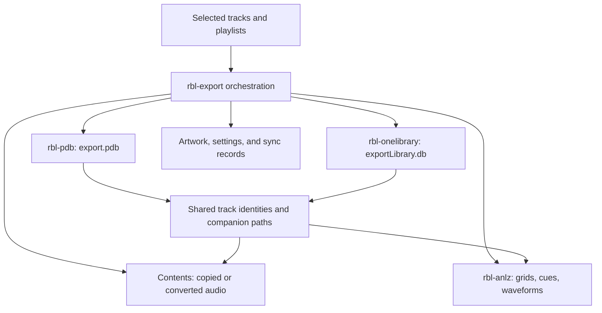
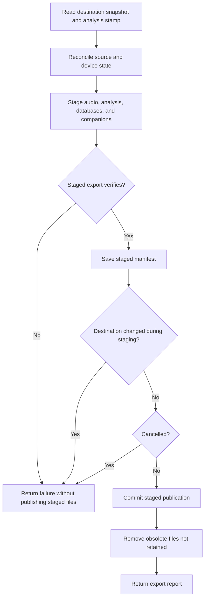

# rekordbox USB export format

This document describes the files and binary records in a normal rekordbox
USB export: where they are stored, how they refer to one another, and how
the player uses them. The concrete reference data comes from rekordbox 7
exports and CDJ-3000 firmware 3.20. Unknown fields, version differences and
observations made with synthesized peripherals are identified explicitly.

The main sections and data appendices describe that reference behavior.
[RBXport implementation](#rbxport-implementation) details and differences
are collected separately at the end.

## Reading this reference

[Documentation](../README.md) · [Export preferences](../user/usb-export.md)

Read the file overview first, then the section for the format you are changing.

| Topic | Sections |
| --- | --- |
| Device layout | [Volume](#1-the-volume), [directories](#2-directory-tree), [audio](#3-audio-files). |
| Databases | [DeviceSQL](#4-exportpdb--the-devicesql-database), [My Tags](#5-exportextpdb--my-tags), [OneLibrary](#6-exportlibrarydb--the-onelibrary-database). |
| Track companions | [Analysis](#7-the-analysis-bundle), [artwork](#8-artwork). |
| Settings and sync | [Device/DJ settings](#9-device-and-dj-settings), [sync records](#10-sync-records). |
| Validation | [Verification](#11-verifying-the-result), [gotchas](#12-gotchas), [unknowns](#13-still-unknown). |
| Code | [RBXport implementation](#rbxport-implementation), followed by fixed-row/schema appendices. |

Keep evidence labels and version boundaries when using these layouts. Structural
verification does not establish compatibility with every firmware or device.

## The short version

### How the export pieces fit together

This diagram shows RBXport's format ownership, not a claim that every player
reads every format. Export orchestration assigns consistent identities and
paths to the databases and their companion files.



### Staging and publication

The export implementation reads the destination before staging, verifies the
staged result, and checks for concurrent changes before publishing. A conflict
or cancellation at these gates must not be presented as a successful export.



See `export_cancellable` in
[`rbl-export`](../../crates/rbl-export/README.md). Publication is a separate
operation that can itself fail; this flow does not promise an atomic whole-volume
filesystem transaction or physical-player compatibility.

The tested CDJ-3000 DeviceSQL playback path uses audio, the library database
and analysis companions. Other files support artwork, browsing options,
rekordbox synchronization and the DJ's settings.

| Path | Read by | Required |
|---|---|---|
| `Contents/<Artist>/<Album>/<file>` | player (audio) | yes |
| `PIONEER/rekordbox/export.pdb` | player (library) | yes |
| `PIONEER/USBANLZ/P###/########/ANLZ0000.DAT` | player (grid, cues, preview waveform) | per track, for anything but a bare file list |
| `PIONEER/USBANLZ/.../ANLZ0000.EXT`, `.2EX` | player (detail and colour waveforms) | needed for their corresponding detailed and colour waveform views |
| `PIONEER/rekordbox/exportExt.pdb` | player (My Tags browsing) | no |
| `PIONEER/rekordbox/exportLibrary.db` | rekordbox 7 device panel | separate from the tested DeviceSQL playback path; contains device-panel metadata |
| `PIONEER/Artwork/#####/…jpg` | player (artwork) | no |
| `PIONEER/DEVSETTING.DAT` | player (display prefs) | no |
| `PIONEER/rekordbox/playlists3*.sync` | rekordbox Sync Manager | no |
| `PIONEER/MYSETTING*.DAT`, `DJMMYSETTING.DAT`, `djprofile.nxs` | player (DJ's settings) | no |

Get `export.pdb` structurally wrong and rekordbox says "Device library is
corrupted" and then hides the volume until it is relaunched. That failure
mode, and how to avoid it, is [below](#the-index-page-requirement).

## 1. The volume

**FAT32.** The reference export layout uses FAT32-compatible names.

**The export root is `PIONEER/` or `.PIONEER/`.** The tested player accepts
both spellings.

**The player mounts it read-write and writes to it.** A CDJ-3000 creates
`PIONEER/rekordbox/RBFLTR.DAT` the first time it browses a volume that has
none. An export does not come back byte-identical from a player, so anything
using a stick as a reference copy should give the player a duplicate.

**Firmware-test limitation.** Swapping backing media under the running
firmware test instance can leave stale library state or a bare folder tree.
Start a fresh instance for each test copy. This is not a claim that physical
CDJs require a power cycle for normal USB insertion.

## 2. Directory tree

The standard device assets form this directory tree:

```text
<volume>/
├── Contents/
│   └── <Artist>/<Album>/<file>.<ext>        audio, one tree for all playlists
└── PIONEER/
    ├── rekordbox/
    │   ├── export.pdb                       DeviceSQL library          (player)
    │   ├── exportExt.pdb                    My Tags                    (player)
    │   ├── exportLibrary.db                 SQLCipher "OneLibrary"     (rekordbox)
    │   ├── playlists3.sync                  sync record                (rekordbox)
    │   └── playlists3Plus.sync              identical bytes to the above
    ├── USBANLZ/
    │   └── P###/########/ANLZ0000.{DAT,EXT,2EX}
    ├── Artwork/
    │   └── #####/{a,b}<id>.jpg, {a,b}<id>_m.jpg
    ├── DEVSETTING.DAT                       player display prefs
    └── MYSETTING.DAT, MYSETTING2.DAT, DJMMYSETTING.DAT, djprofile.nxs
```

## 3. Audio files

The verified reference layout places audio at
`/Contents/{artist}/{album}/{filename}`. Directory names in the reference
are truncated to 48 characters. The tests described here do not establish
that every alternative directory layout works.

Paths in the databases are volume-relative with a leading slash. The audio
path and each analysis companion's `PPTH` must identify the actual file.
The analysis directory is calculated from that final audio path (§7).
For example, `/Contents/A/B/one.mp3` maps to
`/PIONEER/USBANLZ/P03B/0002F797/ANLZ0000.DAT`.

Renaming or moving audio requires updating both its database/PPTH references
and analysis directory. Library databases remain under the selected
`PIONEER/rekordbox/` or `.PIONEER/rekordbox/` root. These paths are not arbitrary.

## 4. `export.pdb` — the DeviceSQL database

### File and page structure

Little-endian throughout. Page 0 is the header:

```text
0x04  u32  page size (4096 in the reference)
0x08  u32  table count
0x0c  u32  next unused page index
0x10  u32  constant 1
0x14  u32  final sequence number
0x1c       table entries, 16 bytes each:
             +0 page type   +4 empty-candidate page
             +8 first page  +12 last page
```

Page header is `0x28` bytes:

```text
0x04 page index   0x08 page type   0x0c next page   0x10 sequence
0x18 row count (u8)
0x19 (rows * 32) & 0xff
0x1a rows / 8
0x1b flags        0x24 = data page; bit 0x40 set = not a data page
0x1c free bytes   0x1e used bytes (rounded up to 4)
0x20 row count u16
0x22 row count u16, only when > 0xff
```

Chain walking stops at the table's last page, a self-link, or `next == 0`.

### The index-page requirement

**Every table must begin with an index page**, not a data page. rekordbox
reads a file whose tables start with a plain data page as corrupted — it
reports "Device library is corrupted" and then hides the volume until it is
relaunched. The index page is:

- flags `0x64`
- `0x1fff` in **both** row-count words
- `0x03ec` at `0x24`
- body: its own index, then the first data page (or `0x03ffffff` when the
  table has none), then `0x03ffffff`, then 1004 copies of `ff 1f f8 ff`,
  ending on the half pattern `ff 1f`

Each table's last data page must also point at a zeroed **empty-candidate**
page named in the header. Trailing all-zero pages are truncated on write, so
the header legitimately names candidate pages past end of file — 41 pages
written, 45 named on the reference export.

Page allocation order matters too: index page and first data page for every
table in table order, then the remaining pages per table in *write* order,
which for `export.pdb` is type 19 first and the rest in table order.

Re-run rekordbox acceptance checks after changing page construction or allocation.

### Tables

All twenty are present in the reference, including empty tables — a player looks the table up by
type, so the empty ones have to exist.

| Type | Contents | Type | Contents |
|---|---|---|---|
| 0 | tracks | 11 | played-history playlists |
| 1 | genres | 12 | played-history entries |
| 2 | artists | 13 | artwork |
| 3 | albums | 14–15 | empty |
| 4 | labels | 16 | columns (browse) |
| 5 | keys | 17 | history playlists |
| 6 | colors | 18 | history entries |
| 7 | playlist tree | 19 | property |
| 8 | playlist entries | 9–10 | empty |

The reader's enum names 17/18 "history", but they are browse settings; the
real play history is 11/12. Type 19 was once named "history" too; it is the
Device Library's `property` row (below).

### Rows within a page

Rows form a heap growing forward from `0x28`, 4-byte aligned. Their offsets
form an index growing **backwards** from the end of the page, in groups of
16 rows with stride `0x24`. For group *g*: `base = page_size - g*0x24`; row
*r*'s u16 offset sits at `base - (6 + 2r)`; a u16 presence bitmask is written
twice, at `base - 4` and `base - 2`.

Two traps: **row offsets are relative to `0x28`, not to the page start**, and **deleted rows keep their index entry** — a reader that
ignores the presence bitmask parses garbage.

The reported free-space figure at `0x1c` accounts for an index overhead of
`2*rows + 4*groups`. This field describes the encoded page, not an exporter's
choice of allocation reserve.

### Strings

Three forms:

| Form | Encoding |
|---|---|
| Short ASCII | one length byte = `(len+1)*2+1`, then text, no terminator |
| Long ASCII | `0x40`, u16 length **counting the 4 header bytes**, pad `0x00`, text |
| UTF-16LE | `0x90`, u16 length counting header and the two trailing NULs, pad, UTF-16LE, `00 00` |

Selection: ASCII shorter than `0x7e` → short; longer ASCII → long; anything
non-ASCII → UTF-16.

### Row layouts

**Track** is `0x5e` fixed bytes followed by 21 u16 string
offsets at `0x5e`. Those offsets are **relative to the row start** — reading
them as page-relative is the documented first mistake.

```text
0x00 subtype=0x24
0x02 index_shift   0x04 bitmask       0x08 sample_rate   0x0c composer_id
0x10 file_size     0x1c artwork_id    0x20 key_id        0x24 original_artist_id
0x28 label_id      0x2c remixer_id    0x30 bitrate       0x34 track_number
0x38 tempo x100    0x3c genre_id      0x40 album_id      0x44 artist_id
0x48 id            0x4c disc          0x4e play_count    0x50 year
0x52 sample_depth  0x54 duration_sec  0x56 trailer=0x29
0x58 color_id (u8) 0x59 rating (u8)   0x5a audio_format  0x5c trailer=3
```

The subtype and trailer words are required for the tested CDJ-3000 path.
Leaving them zero produced a named but empty playlist even though a
semantic reader could find every track. The trailer meanings remain
uncharacterized; the writer reproduces rekordbox's values. `audio_format`
is derived from the final exported filename: MP3=1, M4A/AAC=4, FLAC=5,
WAV=11, AIFF=12. A converted track must use its destination format.

String slots: 0 ISRC, 7 hot-cue auto-load, 10 date added, 11 release date, 12 mix name, 14
analyze path, 15 analyze date, 16 comment, 17 title, 19 filename, 20 file
path. **Unused slots must point at a real empty string, not at 0**.

Slot 7 contains `"ON"` when the source track enables hot-cue auto-load,
otherwise an empty string. This must agree with OneLibrary's
`isHotCueAutoLoadOn`. With the deck set to REKORDBOX SETTING, cue markers
alone did not make the pads recall saved cues until this legacy flag was
written.

Other rows worth the detail:

- **Artist**: u16 subtype `0x60`, id at `0x04`, `0x03` at
  `0x08`, name offset byte at `0x09`. Subtype `0x64` moves that offset to a
  u16 at `0x0a`.
- **Album**: u16 `0x80`, artist id at `0x08`, **id at
  `0x0c`**, `0x03` at `0x14`, name offset at `0x15`. Id and artist were once
  swapped here, which a player reads as every album having id 0.
- **Playlist tree**: parent, **a zero word**, sort order,
  id, folder flag, then the name at offset 20 — five words, not four.
- **Playlist entry**: entry index, track id, playlist id. 12 bytes.
- **Colors**: 8-byte prefix, id as u8 at 4 and u16 at 5,
  name at 8. Eight fixed labels in rekordbox's order — Pink, Red, Orange,
  Yellow, Green, Aqua, Blue, Purple.
- **Artwork**: u32 id plus an inline string naming the image, e.g.
  `/PIONEER/Artwork/00001/a1.jpg`.
- **Genres, labels, keys**: id plus name, keys writing the id twice.

### Ordering

Playlist `sort_order` is the 1-based enumeration index. Playlist entry
positions in the reference are dense and 1-based. Browse sort order comes from
the fixed `columns` table, not from the data.

### Tables copied verbatim

The exact rows are embedded in Appendix A.

`columns`, `history_playlists` and `history_entries` are written as captured
rekordbox bytes rather than re-encoded, to stop drift;
the column names are UTF-16 wrapped in `0xfffa`/`0xfffb` markers.

### `property` row (type 19)

One live row: the Device Library's copy of `exportLibrary.db`'s `property`
row, plus the Device Library's own background colour. Read from rekordbox
7.2.14 on a 1317-track stick [OBS 2026-10-08]: the count, date, version and
name matched that stick's `exportLibrary.db` `property` row, and changing
only "Background Color : Device Library" from Yellow to Blue changed only
byte `0x09`, from 4 to 7.

| Offset | Bytes | Contents |
|---|---|---|
| `0x00` | `80 02` | Constant |
| `0x02` | u16 | Index shift, row index × 32 |
| `0x04` | u32 | `numberOfContents` |
| `0x08` | `00` | Constant |
| `0x09` | u8 | Background Color : Device Library, values below |
| `0x0a` | `00 00` | Constant |
| `0x0c` | string | `createdDate`, `YYYY-MM-DD` |
| | `19 1e` | Constant [UNKNOWN] |
| | string | `dbVersion`, `1000` |
| | string | `deviceName` |
| | 8 bytes | Zero, then padding to a multiple of four |

rekordbox does not change the row in place. It adds a new row and clears
the old row's presence bit, so a used stick has dead rows on the page with
earlier values. rbxport writes one row and replaces it in place.

Both background colours use the track-colour order: 0 Default Color, 1
Pink, 2 Red, 3 Orange, 4 Yellow, 5 Green, 6 Aqua, 7 Blue, 8 Purple. Purple,
Yellow and Blue were observed; the other values are [ASSUME] from that order.

## 5. `exportExt.pdb` — My Tags

Same page format, same builder, `PAGE_SIZE` 4096, nine tables (types 0–8),
write order `[7, 3]`.

**Type 3, one row per tag**: categories in `Seq`
order each followed by their own tags, orphans last.

```text
0x00 u16 0x0680
0x02 u16 row index on page * 32   (restarts per page)
0x0c u32 parent id (0 for a category)
0x10 u32 Seq - 1
0x14 u32 id
0x1b     1 = category, 0 = tag
0x1c     0x03 (empty short string)
0x1d     name offset
0x1e     offset of the trailing empty string
```

Unlike `export.pdb`, a UTF-16 name here has its **trailing NUL pair
truncated** and the length fixed up to match.

**Type 7, one master row**: `00 07 00 00`, 20 zeros,
u32 `myTagMasterDBID` at `0x18`, then `0x03` and five offsets to empty
strings. 39 bytes, padded to 60 because the page reports 60 used.

Type 5 is a candidate for track-to-tag associations by analogy with
`export.pdb`; that interpretation and its record layout are unverified. The master id's
derivation is also unknown: rekordbox's reference wrote `1744129535`.
The same master ID must appear in the extended database and
OneLibrary property row.

## 6. `exportLibrary.db` — the OneLibrary database

**SQLCipher 4.** Open it with `PRAGMA cipher=sqlcipher`, then `legacy=4`,
then `key`, in that order — out of order the key is read under the wrong
parameters and the first read fails. The
database requires the appropriate passphrase before its schema can be read.

Appendix B embeds all twenty-two `CREATE TABLE` statements and initial browse
rows. Several tables are required to exist while empty. `dbVersion` is
`"1000"`.

- `content` — tracks, including
  `masterDbId`/`masterContentId` (identity back to the desktop library),
  `analysisDataFilePath`, `path`, `bpmx100`, `bitrate`, `samplingRate`,
  track/disc numbers, bit depth, play count, analysis flags, hot-cue
  auto-load, creation date and ISRC.
- `artist`, `album`, `genre`, `label`, `key`, `color` — interned and deduped;
  an empty name is id 0, which is how the reference spells "none".
- `image` — `(image_id, path)`, the id being **the same one `export.pdb`'s
  artwork table uses**.
- `myTag`, `myTag_content`; `playlist`, `playlist_content`; `history`,
  `history_content`; `cue`; `hotCueBankList*`; `recommendedLike`.
- `property` — one row: `deviceName`, `dbVersion`, `numberOfContents`,
  `createdDate` (a date, `YYYY-MM-DD`, not a timestamp),
  `backGroundColorType` (Background Color : OneLibrary, values as in the
  [`property` row](#property-row-type-19)), `myTagMasterDBID`.
- **`menuItem`, `category`, `sort`** — the browse columns and sort options a
  player offers, and their order. An export without them opens but browses
  wrong. Menu names are wrapped in U+FFFA/U+FFFB
  interlinear-annotation markers, which is how rekordbox flags a string for
  display-time translation; writing the bare word leaves a player showing
  English whatever its language is set to.

The CDJ-3000 validation here does not establish that the player reads this file — the player's runtime
path is `export.pdb` plus the ANLZ tree. It is rekordbox's device panel that
needs it, and it is where the per-device settings rekordbox shows live:
device name, browse categories, sort options, sub-column, the eight colour
comments. `DEVSETTING.DAT` does *not* carry those.

## 7. The analysis bundle

Available DAT, EXT and 2EX companions are exported as `ANLZ0000` in a
directory derived from the **final USB audio path**, not the export ID.
The CDJ-3000 firmware computes this directory itself; merely pointing the
database at an arbitrary folder did not make its waveforms load.

The following calculation reproduces firmware 3.20:

1. Take the leading-slash audio path, preserving case, as UTF-16 code units
   up to the first NUL.
2. Start `h = 0`. For each unit `c`, compute
   `h = (h * 0x34F5501D + c * 0x93B6) mod 2^32`.
3. After the whole path, set `hash = h % 0x30D43`.
4. Pack hash bits `[0, 2, 6, 7, 9, 13, 16]` into shard bits `0..6`.
5. Write `/{root}/USBANLZ/P{shard:03X}/{hash:08X}/`.

Both directory components are uppercase hexadecimal. Compute this after
sanitization, audio filename collision handling and compatibility conversion.
The mapping matches all 61 reference tracks; for example the exported Drum Death
path
`/Contents/Hosanna, Westend/Drum Death - Extended Mix/20130688_drum_death_(extended_mix).mp3`
resolves to `P002/0002583E`.

Every companion's embedded `PPTH` must identify the final USB audio path,
not the desktop share path `?/filename`.

| File | Tags |
|---|---|
| `.DAT` | `PPTH`, `PQTZ` (grid), `PWAV`, `PWV2`, `PCOB` cue lists |
| `.EXT` | `PPTH`, `PWV3`, `PWV4`, `PWV5`, `PCOB` and `PCO2` cue lists, `PSSI`, `PQT2` |
| `.2EX` | `PPTH`, `PWV6`, `PWV7`, `PVDI` |

The track row's analyze path names **only the `.DAT`**; the player finds the siblings by swapping
the extension.

### Framing

`PMAI` magic, then big-endian `len_header` at 4 and total file length at 8,
then `len_header - 12` bytes of header extra — rekordbox's is the constant
`00000001 00010000 00010000 00000000`, reproduced rather than derived. Sections follow back to back to end of file:
fourcc, `len_header`, `len_tag`, tag-specific header fields up to
`len_header`, then payload to `len_tag`. All big-endian. No padding, no
alignment.

The trap: `len_header` **differs per tag** — 16
for `PPTH`, 20 for `PWAV`, 24 for `PQTZ`, 14 for `PWVC` — and reading those
header fields as payload silently eats real data.

### Beat grid — `PQTZ`

Header is `0`, then `0x0008_0000` whose low 16 bits are a **signed i16
millisecond correction**, then the beat count. Eight bytes per beat:
`beat_number` u16 (1–4, 1 being the downbeat), `tempo_x100` u16, `time_ms`
u32. Times are integer milliseconds at 100 % pitch; tempo is per beat, so a
tempo change is just the next beat carrying a different figure.

That header offset is what rekordbox's grid-shift writes: it moves the whole
grid without touching a single beat record. A reader that
ignores it is wrong by exactly that much.

`PQT2` mirrors the grid with a per-beat u16 whose derivation is unknown.

### Waveforms

| Tag | File | Stride | Columns | Payload |
|---|---|---|---|---|
| `PWAV` | DAT | 1 | 400 | `wwwhhhhh` — 3 bits whiteness, 5 bits height |
| `PWV2` | DAT | 1 | 100 | same encoding |
| `PWV3` | EXT | 1 | 150/s | same encoding |
| `PWV4` | EXT | 6 | 1200 | `peak>>1`, 0, 0, `mid>>1`, `high>>1`, `low>>1` |
| `PWV5` | EXT | 2 | 150/s | be16 `rrrgggbbbhhhhh00` |
| `PWV6` | 2EX | 3 | 1200 | low, mid, high |
| `PWV7` | 2EX | 3 | 150/s | `band>>1` |

**The five-bit tags do not share a ceiling.** `PWAV` stops at 25, `PWV2` at
15, the detail tags use all 31. A renderer that
assumes full scale draws every loud track as a flat block. The three-band
bytes are likewise an already-scaled drawing height, not a magnitude: on
loud material they still sit near a quarter of the byte.

`PWV6`'s section header is **20 bytes, not the 24** the other scroll tags
use — a real shape trap.

### Cues

`PCOB` (older) and `PCO2` (with colour and comment) lists, one per kind:
header carries the list type, 1 for hot cues and 0 for memory cues. A `PCP2`
entry: magic, length at +8, `hot_cue` u32 at +12 (0 =
memory), `kind` u8 at +16 (1 cue, 2 loop), `time_ms` at +20, `loop_time_ms`
at +24, `color_id` at +28, minimum 40 bytes, then a comment length at +40
with a UTF-16BE comment, and **four bytes of colour index plus RGB after the
comment** — not at a fixed offset.

The source share files can contain empty cue lists even when the library
has cues. Reference DAT lists contain memory cues and hot cues A-C; EXT
contains the additional legacy hot slots and complete extended lists.
The record tables below describe those disk representations.

### Cue record tables

The layouts below describe captured compatible disk records. All numeric
fields are big-endian. Counts are u16. Offsets are relative to the section
or entry start, as indicated. Preserve fields whose meaning is unknown when
reading and rewriting an existing record.

| Cue-list section field | PCOB | PCO2 |
|---|---|---|
| Magic at `0x00` | `PCOB` | `PCO2` |
| Header length at `0x04` (u32) | 24 | 20 |
| Total length at `0x08` (u32) | Header + all entries | Header + all entries |
| List type at `0x0c` (u32) | 1 hot, 0 memory | 1 hot, 0 memory |
| Count | u16 at `0x12` | u16 at `0x10` |
| u32 at `0x14` | `0xffffffff` for hot/empty; otherwise count − 1 | Not part of header |

| Entry field | PCPT (legacy, 56 bytes) | PCP2 (extended, 88 + L bytes) |
|---|---|---|
| Magic `0x00` | `PCPT` | `PCP2` |
| Header length `0x04` u32 | 28 | 16 |
| Total length `0x08` u32 | 56 | 88 + L |
| Hot-cue slot `0x0c` u32 | 0 memory, 1–16 A–P | Same |
| Active-loop flag | u32 at `0x10`: 4 active, otherwise 0 | Not stored in this field |
| Constant | u32 at `0x14`: `0x00010000` | See kind/times below |
| Previous/next indices | u16 at `0x18`/`0x1a`; memory entries link to adjacent zero-based indices; absent or hot links are `0xffff` | Not stored here |
| Kind | u8 at `0x1c`: 1 cue, 2 loop | u8 at `0x10`: 1 cue, 2 loop |
| Three bytes after kind | `00 03 E8` | `00 03 E8` |
| Start milliseconds | u32 at `0x20` | u32 at `0x14` |
| Loop-end milliseconds | u32 at `0x24`; `0xffffffff` for no loop | u32 at `0x18`; same sentinel |
| Memory color ID | Not stored | u8 at `0x1c`; hot cues use 0 |
| Constant byte | Not stored | `0x01` at `0x1d` |
| Loop numerator/denominator | Not stored | u16 at `0x24`/`0x26` |
| Comment byte length L | Not stored | u32 at `0x28` |
| Comment | Not stored | At `0x2c`, UTF-16BE including final NUL; empty comment has L=0 |
| Color code, R, G, B | Not stored | Four bytes at `0x2c + L` |

The following complete palette maps decimal color codes to RGB bytes.
Code 0 stores a zero code byte but chooses RGB through the default-slot table
below. The behavior of out-of-range codes on the player is not established.

| Code | RGB hex | Code | RGB hex | Code | RGB hex |
|---|---|---|---|---|---|
| 0 | `000000` | 22 | `1AFF00` | 44 | `FF002E` |
| 1 | `0000FF` | 23 | `33FF00` | 45 | `FF0045` |
| 2 | `001CFF` | 24 | `4DFF00` | 46 | `FF005C` |
| 3 | `0038FF` | 25 | `66FF00` | 47 | `FF0073` |
| 4 | `0054FF` | 26 | `80FF00` | 48 | `FF008A` |
| 5 | `0070FF` | 27 | `99FF00` | 49 | `FF00A1` |
| 6 | `008CFF` | 28 | `B3FF00` | 50 | `FF00B8` |
| 7 | `00A8FF` | 29 | `CCFF00` | 51 | `FF00CF` |
| 8 | `00C4FF` | 30 | `E6FF00` | 52 | `FF00E6` |
| 9 | `00E0FF` | 31 | `FFFF00` | 53 | `FF00FF` |
| 10 | `00FFFF` | 32 | `FFE800` | 54 | `E600FF` |
| 11 | `00FFE8` | 33 | `FFD100` | 55 | `CC00FF` |
| 12 | `00FFD1` | 34 | `FFBA00` | 56 | `B300FF` |
| 13 | `00FFBA` | 35 | `FFA300` | 57 | `9900FF` |
| 14 | `00FFA3` | 36 | `FF8C00` | 58 | `8000FF` |
| 15 | `00FF8C` | 37 | `FF7500` | 59 | `6600FF` |
| 16 | `00FF75` | 38 | `FF5E00` | 60 | `4D00FF` |
| 17 | `00FF5E` | 39 | `FF4700` | 61 | `3300FF` |
| 18 | `00FF47` | 40 | `FF3000` | 62 | `1A00FF` |
| 19 | `00FF30` | 41 | `FF1A00` | 63 | `000000` |
| 20 | `00FF1A` | 42 | `FF0000` | 64 | `FFFFFF` |
| 21 | `00FF00` | 43 | `FF0017` |  |  |

| Slot when code is 0 | Palette index used for RGB |
|---|---|
| A or I (1 or 9) | 43 |
| B or J (2 or 10) | 8 |
| C or K (3 or 11) | 23 |
| D or L (4 or 12) | 60 |
| Other slots, including memory | 0 |

A complete 88-byte PCP2 example: hot cue A at 83,032 ms, no loop or comment,
color code 46 (RGB `FF005C`):

```text
50 43 50 32 00 00 00 10 00 00 00 58 00 00 00 01
01 00 03 E8 00 01 44 58 FF FF FF FF 00 01 00 00
00 00 00 00 00 00 00 00 00 00 00 00 2E FF 00 5C
00 00 00 00 00 00 00 00 00 00 00 00 00 00 00 00
00 00 00 00 00 00 00 00 00 00 00 00 00 00 00 00
00 00 00 00 00 00 00 00
```

### Phrase data and export mask

All offsets below are from the beginning of the `PSSI` section, including
its 12-byte common framing. Integers are big-endian.

| Offset | Type | Value or meaning |
|---|---|---|
| `0x0c` | u32 | Entry size, 24 |
| `0x10` | u16 | Phrase count `n` |
| `0x12` | u16 | Mood: 1 high, 2 mid, 3 low |
| `0x14` | 6 bytes | Unknown; preserve |
| `0x1a` | u16 | End beat |
| `0x1c` | 2 bytes | Unknown; preserve |
| `0x1e` | u8 | Lighting bank |
| `0x1f` | u8 | Unknown; preserve |
| `0x20` | 24 × n bytes | Phrase entries |

Within each 24-byte phrase entry:

| Offset | Type | Meaning |
|---|---|---|
| `0x00` | u16 | One-based index |
| `0x02` | u16 | First beat |
| `0x04` | u16 | Kind, interpreted with mood |
| `0x07`, `0x09`, `0x13` | u8 each | High-mood variants k1, k2, k3 |
| `0x0b` | u8 | Additional-beat variant |
| `0x0c`, `0x0e`, `0x10` | u16 each | Internal lighting beat hints |
| `0x15` | u8 | Nonzero for a fill-in |
| `0x16` | u16 | Fill-in start beat |

Preserve all unspecified bytes. The 19-byte mask base is:

```text
CB E1 EE FA E5 EE AD EE E9 D2 E9 EB E1 E9 F3 E8 E9 F4 E1
```

For each byte at section offset `0x12 + i`, XOR with
`(base[i % 19] + (n & 0xff)) & 0xff`. XOR is its own inverse.
A plaintext mood is 1, 2 or 3. Masked and plaintext source sections both
exist; distinguish them before applying the transform to avoid masking an
already masked section twice.

`PWV6` and `PWV7` are three-band waveforms. `PSSI` carries phrase data for
Lighting; `PVDI` is rekordbox metadata.

## 8. Artwork

`/PIONEER/Artwork/{id/20+1:05}/{a,b}{id}{,_m}.jpg` — **four files per
image**, twenty images to a five-digit folder.

- `a<id>.jpg` is the library's 80×80 `artwork_s.jpg`, byte for byte
- `a<id>_m.jpg` is its 240×240 `artwork_m.jpg`
- each `b` file is the same bytes as its `a`

Verified by md5 against `share/PIONEER/Artwork` over 61 images. The
`export.pdb` artwork row names only the small `a` file and the player is
assumed to derive the other three names — marked `[ASSUME]`.

Over LINK a player is served the **medium** file, not the full one. Sending
the full file left much of a CDJ-3000's list without art; rekordbox 7.2.11's
127 replies to a CDJ-3000 ran 2.5–32 KB.

## 9. Device and DJ settings

### `DEVSETTING.DAT`

Exactly 140 bytes, checked byte for byte
against a real rekordbox 7.2.8 export and against rekordcrate and
pyrekordbox:

```text
0x00 u32LE 0x60           0x04 [32] "PIONEER DJ"
0x24 [32] "rekordbox"     0x44 [32] version (reference string "7.2.11")
0x64 u32LE 32             0x68 [32] body
0x88 u16LE CRC-16/XMODEM over the 32 body bytes
0x8a u16 0
```

Body is `78 56 34 12 01 00 00 00 01`, then at offsets 9–13 the overview
waveform type, waveform colour, a byte that is always `01`, the key display
format and the position marker, then 18 zeros. It carries four player display
preferences: waveform colour (Blue/RGB/3Band), position (Center/Left),
overview (Half/Full), key display (Classic/Alphanumeric).

The CRC is XMODEM (poly 0x1021, init 0, no reflection) over the body alone
for `DEVSETTING`, `MYSETTING` and `MYSETTING2`, but over the header as well
for `DJMMYSETTING`. Parsing refuses a wrong length, a body length other than
32, or a bad checksum.

### The DJ's My Settings

`MYSETTING.DAT`, `MYSETTING2.DAT`, `DJMMYSETTING.DAT` and `djprofile.nxs`
carry the DJ's settings under the device root. Players can modify them.

## 10. Sync records

`playlists3.sync` and `playlists3Plus.sync`, identical bytes, UTF-8 XML with
**CRLF** and a blank line after the declaration:

```xml
<?xml version="1.0" encoding="UTF-8"?>

<Sync DBID="1912725212" AutomaticSync="1" AllPlaylists="0" IncludeCue="1" ForcedSync="0" Timestamp="0">
  <Playlists>
    <NODE Id="0" ParentId="0" Attribute="1" Lib_Type="0" Dev_ID="0" Timestamp="0" CheckType="2"/>
    <NODE Id="FFB7D23B" ParentId="0" Attribute="0" Lib_Type="0" Dev_ID="1" Timestamp="1789685972345" CheckType="1"/>
  </Playlists>
</Sync>
```

`DBID` is the library's `djmdProperty.DBID`. A node's `Id` is
`djmdPlaylist.ID` in **upper-case hex**, 0 for the root. `Attribute` is 0 for
a playlist, 1 for a folder, 4 for an intelligent playlist. `CheckType` is 1
for a ticked playlist and 2 for a folder with something ticked beneath it.

`Timestamp` is milliseconds since the epoch when the playlist was *first*
ticked for this device, not the export time — rekordbox reproduced the same
value after the stick had been erased, so it keeps it in its own library.

This is what rekordbox's Sync Manager reads back to open on the same
selection and to drive automatic synchronisation.

## 11. Verifying the result

**The ceiling.** Two rekordbox exports of the same playlist to blank sticks
agree on 556 of 562 files and differ in six: `export.pdb`, `exportExt.pdb`,
`exportLibrary.db` and its `-wal`/`-shm`, and the random-uuid
`DeviceLibBackup` record. Those six are compared by content; everything else
must match byte for byte. "Identical" cannot mean more than that.

### Acceptance criteria and comparison limits

After export, unmount and remount the volume before read-back verification.
Audio and playlist-entry counts must match the selected source tracks.
Analysis companion counts must match the source bundles; waveform and grid
counts must match the analyzed tracks. Exported hot-cue and memory-cue
counts must match the source database. Missing files and verification errors
must be zero.

Compare waveform, PQTZ, legacy/extended cue and PSSI sections individually
against an equivalent rekordbox export. Extra source PVDI sections or empty
PQT2 sections can produce whole-file differences without losing reference
sections. Copying existing sections byte-for-byte does not establish parity
for analysis newly synthesized from arbitrary audio.

When comparing settings, distinguish preserved device settings from deliberately
changed preferences.
DEVSETTING's unknown byte at `0x78` and its dependent CRC may differ between
reference devices. Timestamps, extra source sections, absent cloud
credentials and populated OneLibrary cue rows can also produce comparator
differences. Treat these as specific differences to assess, not grounds for
claiming whole-export byte equality.

Physical-player acceptance must cover playlist browsing, track loading and
playback, both waveform views, beat markers, saved hot-cue and loop recall,
memory-cue recall, and device settings. Stock firmware with synthesized
peripherals can exercise these behaviors, but does not replace a physical
CDJ test. In particular, showing a cue marker does not prove that pressing
the pad recalls the saved cue.

## 12. Gotchas

- Every `export.pdb` table needs an index page and a named empty-candidate
  page, or rekordbox calls the library corrupted and hides the volume.
- All twenty tables must exist, empty ones included.
- Track-row string offsets are row-relative; row index offsets are relative
  to `0x28`; the presence bitmask decides which rows are real.
- Track subtype `0x24`, trailer words `0x29`/`3`, and the destination audio
  format code are required; semantic round-trip tests alone missed them.
- Unused string slots point at an empty string, not at 0. Slot 7 must carry
  `"ON"` when hot-cue auto-load is enabled.
- Album rows carry the id at `0x0c`, not where a reader might expect it.
- Playlist tree rows are five words, with a zero word after the parent.
- ANLZ `len_header` varies per tag; the `PWV6` header is 20 bytes.
- The `PQTZ` header carries a signed millisecond grid offset.
- The five-bit waveform tags have different ceilings: 25, 15, 31.
- Paths in the database are volume-relative with a leading slash, and must
  use whichever root spelling the stick already uses.
- Export ids must be stable across syncs; decks cache against them.
- The `menuItem`/`category`/`sort` rows decide browse columns; their names
  need the U+FFFA/U+FFFB markers or a player shows English.
- Give a player a copy of a reference stick — it writes `RBFLTR.DAT`.
- Restart firmware test instances when changing their backing media.
- Hash the final USB audio path for the analysis directory, and rewrite
  PPTH in every companion. Export cues from the database, not empty share lists.

## 13. Still unknown

- `exportExt.pdb` type 5, where a track's tag links would go, and the
  derivation of `myTagMasterDBID` (rekordbox wrote `1744129535`).
- `PWV4` header bytes 1–2, the third header word of `PWV3`/`PWV5`, and the
  `PQT2` payload derivation.
- Remaining reader/UI cue display-color measurements; the export palette
  is captured separately and is no longer an export blocker.
- `DEVSETTING.DAT` body bytes 14–16, which rekordbox sets after editing its
  Category/Sort/Color tabs and writes inconsistently at `0x78`.
- `Dev_ID`, `Lib_Type`, `AllPlaylists`, `IncludeCue`, `ForcedSync` in the
  sync record, and what a fully ticked folder gets.
- The two constant bytes `19 1e` between the date and the version in
  `export.pdb`'s `property` row.
- The embedded schema contains twenty-two tables while
  a separate real-stick observation counted twenty-six. Not reconciled — it may be a version or a
  counting difference.

## RBXport implementation

Everything below describes RBXport, not additional requirements of the
Pioneer USB format. These policies cover file naming, data mapping,
preservation, publication, recovery, validation and UI behavior.

### Files, names and format conversion

#### Private on-disk artifacts

| Path | Purpose |
|---|---|
| `PIONEER/rbxport/manifest.json` | Track ownership, stable IDs, source identity and per-file hashes for incremental sync |
| `.rbxport-publication/` | Transient publication/recovery state on the volume |
| `publication.json` inside publication state | Durable record used to complete an interrupted publication |

Use the existing `.PIONEER` spelling instead of `PIONEER` when selected.
Players and rekordbox do not need these bookkeeping files.

#### Audio naming and conversion

the placement, fallback names, truncation,
collision suffixes and conversion policy below describe RBXport's writer.
They reproduce parts of the reference layout but are not universal player
requirements. Volume-relative paths and filesystem-valid names remain
compatibility requirements.

**Placement** is `/Contents/{artist}/{album}/{filename}`. Empty artist or album become `UnknownArtist` and
`UnknownAlbum`.

**Directory names** use the filename sanitization below,
then cut to 48 characters, then trailing dots and spaces stripped again,
empty becomes `Unknown`. The 48-character cut is rekordbox's own — four
albums on the reference export were cut at exactly 48.

**Filename sanitization** maps `/ \ : * ? " < > |` and every
character below `0x20` to `_`, strips trailing dots and spaces, and truncates
at 120 bytes on a character boundary. The filename keeps the source's
basename through this sanitization but is *not* cut to 48.

**Collisions** are resolved on `path_key` = NFC + lowercase, so the check is both case- and normalisation-insensitive
— FAT and macOS both need that. The first duplicate gets `-{export_id}`
appended, then `-{export_id}-{serial}`. A suffixed name from a previous
manifest is reused when the parent directory and source still match, so a
re-sync does not churn filenames.

**Paths in the database are volume-relative with a leading slash**:
`/Contents/A/B/one.mp3`, `/PIONEER/USBANLZ/P03B/0002F797/ANLZ0000.DAT`. The player joins these onto the mount root. Path validation rejects absolute components, `.` and `..` and anything
that canonicalises outside the volume.

**Formats.** Compatible MP3 and integer-PCM WAV/AIFF at 44.1 or 48 kHz are
copied as-is. With Maximum CDJ compatibility on, anything else is converted
to 16-bit 44.1 kHz stereo WAV/AIFF or 320 kbps CBR MP3 and renamed
`{stem}-rbx-cdj-{export_id}.{ext}`. A duplicate produced
*by* conversion is a `Conflict`, not a silent overwrite. Surround audio is
refused rather than downmixed; WAV or AIFF past its 32-bit container limit is refused.

#### Filesystem validation

Filenames are sanitized for FAT32 and database
file sizes are clamped to `0xffffffff` (4,294,967,295). Its destructive parity
test requires two explicitly selected FAT32 test volumes.

#### Root selection

Select whichever root already holds `rekordbox/export.pdb`,
`rekordbox/exportLibrary.db` or `DEVSETTING.DAT`; a stick with both is a hard
`Conflict` rather than a guess. Every `/PIONEER/` literal written into a
database row is rewritten to the chosen root. On a blank HFS+ volume, match
rekordbox by selecting `.PIONEER` [OBS: HFS+ export report, 2026-10-07];
other blank volumes start with `PIONEER`.

#### Initial directory creation

Create `Contents`, the selected export root's `USBANLZ`, and its `Artwork`
directory up front, including for an empty export. Bookkeeping files use
the private locations listed above.

#### Private bookkeeping files

`manifest.json` sits outside `rekordbox/` deliberately, so no player and no
version of rekordbox has to know about it.

### Database writing and metadata

#### Metadata and cue mapping

These tables specify how RBXport maps source
library fields into the device formats, including its defaults and conversions.

Numeric source NULLs become zero and text NULLs become empty strings unless
specified below. Exported file type always describes the destination audio.

| Source value | DeviceSQL target | OneLibrary content target |
|---|---|---|
| TrackNo | u32 `0x34` | `trackNo` |
| DiscNo | u16 `0x4c` | `discNo` |
| BitDepth | u16 `0x52` | `bitDepth` |
| DJPlayCount | u16 `0x4e` (clamped to 65,535) | `djPlayCount` |
| Analysed | No corresponding mapping here | `analysedBits = Analysed & ~64` |
| HotCueAutoLoad equals lowercase `on` | Slot 7 `ON`, otherwise empty | `isHotCueAutoLoadOn` 1 or 0 |
| DateCreated | Separate date-added slot is retained | `dateCreated` |
| ISRC | String slot 0 | `isrc` |
| Final filename extension | u16 `0x5a` | `fileType` |

| OneLibrary cue column | Value |
|---|---|
| `content_id` | Exported content ID |
| `kind` | Source kind, including the gap at 4 |
| `colorTableIndex` | Source extended color code |
| `cueComment` | Source comment |
| `isActiveLoop` | Boolean source active-loop state |
| `beatLoopNumerator`, `beatLoopDenominator` | High/low 16 bits of source BeatLoopSize |
| `inUsec`, `outUsec` | Start/end milliseconds × 1,000; absent end is −1 |
| `in150FramePerSec`, `out150FramePerSec` | Integer floor(milliseconds × 150 / 1,000); absent end is −1 |
| Remaining optional cue columns | NULL for newly inserted rows |

#### My Tags identity

Leave the uncharacterized type-5 table empty.

Use the library `DBID`, and the same number must appear in
`exportLibrary.db`'s `property.myTagMasterDBID`.

#### OneLibrary publication

Write with `journal_mode=DELETE` and
`synchronous=EXTRA`, producing no `-wal`/`-shm`. Publication deletes an inherited pair
so a rebuilt database cannot carry stale WAL pages. rekordbox does leave them behind.

#### OneLibrary cue replacement

Selected source tracks also populate `cue` rows from the library's
`djmdCue`; cue rows belonging to retained device-only tracks survive the
rebuild.

#### OneLibrary settings preservation

On an incremental sync, `category`, `sort`, `color` and `property` rows
are read back before the rebuild, so a renamed colour or a reordered
category survives. If exactly one of `export.pdb` and
`exportLibrary.db` exists, the export converts by reading the one that is
there rather than publishing an empty sibling over it.

#### Background colours

An export carries `property.backGroundColorType` from the stick's
`exportLibrary.db` and the background byte from its `export.pdb` `property`
row. A stick without one starts at 0. The device panel's General tab writes
each colour to its own database: the OneLibrary colour with the other
`exportLibrary.db` settings, the Device Library colour by replacing the
`export.pdb` `property` row. A device-name change is copied to that row
too. A value outside 0–8 that the stick already holds is kept.

#### DeviceSQL writer policies

Roll a page over when available heap space is less than the next row's size
plus eight bytes. Skip tracks that failed to export when assigning playlist
entry positions, retaining a dense one-based sequence. Refuse history dates
that are not exactly ten ASCII bytes in `YYYY-MM-DD` form.

#### Device playlist edits

rekordbox's Devices tree lists each library on a stick on its own, Device
Library and OneLibrary, each with All Tracks, Playlists and Hot Cue Bank
Lists, and an edit there changes only the library it is made in
[OBS rekordbox 7.2.14 for Windows, Winrig 2026-10-08, on a fixture stick;
DOC rekordbox FAQ "Device Library Plus"]. What it wrote for each edit, read
back from both files [OBS, same session]:

| Edit | Rows written |
| --- | --- |
| Create New Playlist / Folder | id = largest id + 1; sequence 0 in its parent; every sibling's sequence + 1, gaps kept; named `Untitled Playlist` / `Untitled Folder`, then renamed in place |
| Rename | the name only |
| Delete | the node (and what is under it) and its entries; the parent's remaining children renumbered from 0 |
| Add To Playlist | an entry appended at n + 1; a track already in the playlist asks Add or Skip |
| Remove from Playlist | the entries removed; the rest renumbered from 1 |

The playlist's tracks stay on the stick unless the Delete Tracks preference
is on (off by default [static: `_kDeviceDeletePlaylistTracksDefaultValue`
is 0]); rekordbox asks about it after a removal or delete.

`rbl_export::device_library` makes the same edits. For `export.pdb` it
rewrites only the `playlist_tree` and `playlist_entries` tables with
`rbl_pdb::build::replace_table`: the table keeps its index page and reuses
its data pages, takes its empty candidate and then fresh pages from the
unused end, and every other table's pages stay byte for byte. Kept rows are
written back as the file held them; a renamed or renumbered row keeps its
first five words. rekordbox's own engine instead deletes and re-inserts the
changed rows in place (presence bits cleared, page flags `0x34`); both read
back as the same rows. For `exportLibrary.db` the edit is SQL on the
`playlist` and `playlist_content` rows of a staged copy. Either file is
read back before it is published through the export journal, and an edit
is refused when the file changed while it was staged.

### Analysis and cue export

#### Analysis path collisions

If different audio paths collide on the hash,
suffix the audio filename and
recompute, including checks against retained analysis directories.

#### Analysis export transformation

Every exported companion's `PPTH` is rewritten to the final leading-slash
USB audio path. Keeping the desktop share file's `?/filename` path is wrong.
Waveforms, grids, seek tables and unknown sections are retained. Plaintext
`PSSI` phrase data is XOR-masked into export form using the algorithm in §7; already masked sections are preserved.
Retained device-only tracks keep their existing analysis bytes.

#### Absent analysis

A track with no DAT gets an empty database analysis path rather than a dangling one.

#### Unknown analysis sections

Preserve each section's raw framing for byte-exact
re-emission, including tags RBXport cannot author.

#### Grid arithmetic

BPM is clamped to 40.00–499.00 and grid arithmetic rounds ties to even.

#### PQT2 preservation

Preserve PQT2 only when a checksum over the old times, beat numbers, tempos,
endpoints and offset all still agree; otherwise it is written empty.

#### Source cue export

Read the source library database's
`djmdCue` rows and replace the DAT/EXT cue lists as follows:

- DAT: legacy `PCOB` memory cues and hot cues A-C.
- EXT: legacy `PCOB` hot cues D-P and an empty legacy memory list, plus
  complete `PCO2` hot-cue and memory lists.
- Preserve cue times, loop endpoints, active-loop state, loop fractions,
  comments, color IDs and color codes in the applicable records.
- Source kind 0 is memory, 1-3 are A-C, and 5-17 are D-P; reserved kind 4
  is excluded. Descending source `rowid` reproduces reference record order.
- An explicitly empty source cue list removes old exported cues on re-sync.

The export encoder uses the captured 65-entry device RGB palette. Code 0
uses the observed slot defaults. This is distinct from the reader/UI's
partially measured display-color table; do not use that table to author
export colors. Reference cue records, including comments and loops, are
covered by golden-byte tests.

#### Cue writer initialization

Initialize unspecified record bytes to zero. Cap each list at 65,535 entries.

#### Cue list ordering

List order is hot then memory. EXT writes both legacy lists first, then
both extended lists. Entries within each list preserve descending source
`rowid` order after filtering.

#### Source cue field conversion

Source `OutMsec` below zero or outside u32 means no loop. `BeatLoopSize`
contains the numerator in its high 16 bits and denominator in its low 16.
For memory cues, source `Color` is a u8 except 255; invalid/255 becomes 0.
Source `ColorTableIndex` supplies the extended color code. `ActiveLoop != 0`
sets the active flag. Source cue kinds map to slots by subtracting one for
kinds 5–17; memory and A–C keep their kind as the slot number.

#### Unknown cue color codes

Out-of-range color codes produce RGB 000000 in the writer.

#### Phrase export handling

On export, apply it only when the unmasked mood at `0x12` is 1, 2 or 3;
otherwise preserve the section as received. Leave bytes before `0x12`
unchanged. This retains existing masked or unrecognized sections and masks
plaintext source sections without changing their musical data.

### Waveform generation and LINK

#### Generated waveform limitations

Generated-waveform regression tests cover the case where rekordbox shows
correct key and BPM but cannot draw the preview. Resampling and scaling
must respect the distinct ceilings documented in §7.

#### Waveform resampling

Resampling keeps the loudest column per bucket.

#### Generated analysis parity

Generated-analysis comparisons show scale differences in
  `PWV4` color channels (RBXport ≈1.8×) and `PWV5` green/blue. Copying existing
  source sections byte-for-byte does not resolve that separate encoder issue.

#### LINK waveform service

Its LINK server serves preview waveforms as `PWAV` + `PWV2` from the `.DAT`; detail
waveform is `PWV3` from the `.EXT`; other tags come by fourcc and extension.
`PWV6`/`PWV7` in the `.2EX` are the CDJ-3000's three-band colour waveforms.
`PSSI` is phrase data for Lighting; `PVDI` is rekordbox-only.

### Device and DJ settings

#### Settings version string

The DEVSETTING writer uses the version string 7.2.11.

#### Unknown settings fields

Unknown bytes are round-tripped as read.

#### Device settings creation

export does not create `DEVSETTING.DAT`.
The device panel creates it when opened on
a stick that holds an export and has no `DEVSETTING.DAT`, which is what
rekordbox does; a stick that already has one keeps it. Renaming a colour also rewrites
the colours table in `export.pdb`, because that is where a player reads
colour names from.

#### My Settings preservation

`MYSETTING.DAT`, `MYSETTING2.DAT`,
`DJMMYSETTING.DAT` and `djprofile.nxs` are copied from the rekordbox settings directory into `PIONEER/` **only when the
stick does not already have them**. An
existing file is the DJ's own, set on a player, and overwriting it would
throw away settings the player wrote.

#### Sync-selection timestamps

Preserve the first-selection timestamp by reading the stick's previous sync record before writing.

### Publication, recovery and ejection

Everything stages into a temporary publication directory on the stick and
commits as one generation. The order:

1. create the three directories, open the publication, load the manifest
2. read and validate a baseline snapshot of the existing export
3. reconcile source and device state: decide add / keep / replace / delete
4. assign playlist ids, then track ids
5. per track: stat the source, convert or copy audio into the stage, write
   the ANLZ files, write artwork
6. playlist rows — explicitly **after** the tracks
7. `export.pdb`, then `exportExt.pdb`, then `exportLibrary.db`
8. My Settings, then the sync records
9. **the manifest last**, so a run that fails part way leaves the older
   record standing and the next attempt re-copies rather than trusting a
   half-written stick
10. re-read the stage and run the verification checks in §11
11. re-read the device and fail with `Conflict` if it changed during staging
12. commit

Commit fsyncs each staged file, fsyncs directories children-before-parents,
checks free space (`required + largest + 1 MiB`), writes `publication.json`,
renames the stage to `.rbxport-publication`, then rolls forward file by file.
Recovery completes an interrupted run before anything else reads the
stick; a missing image is an error, never an instruction to delete data.
Obsolete files are removed only *after* the commit, and only if not retained.

Every track write re-checks the volume's dev/ino to catch the stick being
swapped, and `ENXIO`/`ENODEV`/`EIO` become `DeviceGone`.

#### Ejecting after publication

RBXport Sync Manager supports both Eject after syncing and a manual eject button
beside each drive. The eject operation rejects ejecting
a drive during an active export and serializes the check with export startup.
The UI removes a drive after successful OS ejection; an eject failure is
reported and leaves the drive listed. A successful sync and a successful
eject are separate results: failure to eject must not be reported as a
failed write or as permission to unplug the drive.

### Incremental sync

A track's identity is `#{library_id}`, or its source path when the id is 0.
**Export ids are pinned to the previous manifest**: ids
must not shift between syncs, because a deck caches artwork and waveforms
against them.

Reusing an existing audio file requires the same path, the same source size
*and* nanosecond mtime, the same conversion profile, **and** a full byte
comparison of source against destination — removable media may have been
edited by something else. Converted files
compare hashes instead. Analysis is rewritten only when the hash or directory
changed, or the bytes on disk differ. The manifest also records expected
analysis extensions and individual companion hashes. A deleted EXT can
therefore be detected and repaired without treating it as a player cue edit.
Changes to surviving musical sections still go through the snapshot conflict
checks; missing companions must not bypass protection of device edits.

RBXport retains content it did not create: playlists on the device that are not
in its previous manifest, their tracks, history tracks, and any track that
arrived via another writer. Those keep their
existing audio and analysis paths and skip conversion. Device-only playlist
ids start at `1 << 63`.

**Loose tracks** are exported tracks in no playlist — Export Track's output.
They are recorded in the manifest so the next sync keeps them, unless
"Delete music not in any playlist" is on.

### Verification and parity tests

Regression coverage must include binary cue records, comments/colors/loops,
metadata and cues in both databases, deletion and repair of companions,
removing source cues on re-sync, hot-cue auto-load agreement, reference
analysis paths and collisions between distinct audio paths.

Its verifier checks either an existing export or the staged generation
before publication. Checks include both
libraries' presence and agreement, unique IDs, case-folded audio paths,
referenced files, playlist hierarchy and membership, and retained history.

Player-specific checks additionally cover:

- Raw track subtype `0x24`, nonzero trailer words, and the audio-format code
  for recognized filename extensions. Writer regression tests assert the
  exact trailer values `0x29` and `3`.
- The analysis directory computed from the final audio path.
- Parseability of present DAT/EXT/2EX companions and agreement of an embedded
  `PPTH`, when present, with the exported audio path.
- Declared versus parsed extended cue counts, and agreement of legacy and
  OneLibrary hot-cue auto-load flags.
- Expected companions recorded in the manifest during explicit verification.

Reports count overview waveforms, detailed waveforms, beat grids, hot cues
and memory cues. These counts make an incomplete source bundle visible;
verification does not invent analysis that the source does not contain.

The RBXport USB parity test goes further: it erases two FAT32 sticks, has rekordbox 7.2.11
export the same playlist to one through its Sync Manager, writes the other
with RBXport, and compares every file.

## Appendix A. Fixed DeviceSQL rows

These rows are the captured defaults from rekordbox 7.2.11, identical for
an empty library and the 61-track reference playlist. Write each hex string
as one row, in the listed order; normal page allocation and alignment still
apply. Their unknown bytes are included rather than guessed.

### Type 16: browse columns

| Row | Exact bytes (hex) |
|---|---|
| 1 | `0100800090120000FAFF470045004E0052004500FBFF0000` |
| 2 | `0200810090140000FAFF410052005400490053005400FBFF` |
| 3 | `0300820090120000FAFF41004C00420055004D00FBFF0000` |
| 4 | `0400830090120000FAFF54005200410043004B00FBFF0000` |
| 5 | `05008500900E0000FAFF420050004D00FBFF0000` |
| 6 | `0600860090140000FAFF52004100540049004E004700FBFF` |
| 7 | `0700870090100000FAFF5900450041005200FBFF` |
| 8 | `0800880090160000FAFF520045004D004900580045005200FBFF0000` |
| 9 | `0900890090120000FAFF4C004100420045004C00FBFF0000` |
| 10 | `0A008A0090260000FAFF4F0052004900470049004E0041004C002000410052005400490053005400FBFF0000` |
| 11 | `0B008B00900E0000FAFF4B0045005900FBFF0000` |
| 12 | `0C008D00900E0000FAFF430055004500FBFF0000` |
| 13 | `0D008E0090120000FAFF43004F004C004F005200FBFF0000` |
| 14 | `0E00920090100000FAFF540049004D004500FBFF` |
| 15 | `0F00930090160000FAFF4200490054005200410054004500FBFF0000` |
| 16 | `10009400901A0000FAFF460049004C00450020004E0041004D004500FBFF0000` |
| 17 | `1100840090180000FAFF50004C00410059004C00490053005400FBFF` |
| 18 | `1200980090200000FAFF48004F00540020004300550045002000420041004E004B00FBFF` |
| 19 | `1300950090160000FAFF48004900530054004F0052005900FBFF0000` |
| 20 | `1400910090140000FAFF530045004100520043004800FBFF` |
| 21 | `1500960090180000FAFF43004F004D004D0045004E0054005300FBFF` |
| 22 | `16008C00901C0000FAFF4400410054004500200041004400440045004400FBFF` |
| 23 | `1700970090220000FAFF44004A00200050004C0041005900200043004F0055004E005400FBFF0000` |
| 24 | `1800900090140000FAFF46004F004C00440045005200FBFF` |
| 25 | `1900A10090160000FAFF440045004600410055004C005400FBFF0000` |
| 26 | `1A00A20090180000FAFF41004C00500048004100420045005400FBFF` |
| 27 | `1B00AA0090180000FAFF4D00410054004300480049004E004700FBFF` |

### Type 17: browse category settings

| Row | Exact bytes (hex) |
|---|---|
| 1 | `0100010063010000` |
| 2 | `0500060005010000` |
| 3 | `0600070063010000` |
| 4 | `0700080063010000` |
| 5 | `0800090063010000` |
| 6 | `09000A0063010000` |
| 7 | `0A000B0063010000` |
| 8 | `0D000F0063010000` |
| 9 | `0E00130004010000` |
| 10 | `0F00140006010000` |
| 11 | `1000150063010000` |
| 12 | `1200170063010000` |
| 13 | `0200020002000100` |
| 14 | `0300030003000200` |
| 15 | `0400040001000300` |
| 16 | `0B000C0063000400` |
| 17 | `1100050063000500` |
| 18 | `1300160063000600` |
| 19 | `1400120063000700` |
| 20 | `1B001A0063020800` |
| 21 | `1800110063000900` |
| 22 | `16001B0063000A00` |

### Type 18: browse sort settings

| Row | Exact bytes (hex) |
|---|---|
| 1 | `0100060001000000` |
| 2 | `1500070003000000` |
| 3 | `0E00080001000000` |
| 4 | `0800090001000000` |
| 5 | `09000A0001000000` |
| 6 | `0A000B0001000000` |
| 7 | `0F000D0001000000` |
| 8 | `0D000F0001000000` |
| 9 | `1700100001000000` |
| 10 | `1600110001000000` |
| 11 | `1900000000010000` |
| 12 | `1A00010000020000` |
| 13 | `0200020000030000` |
| 14 | `0300030000040000` |
| 15 | `0500040000050000` |
| 16 | `0600050000060000` |
| 17 | `0B000C0000070000` |

### Type 19: property row

The row for a blank stick dated `2026-09-17` [OBS 7.2.11]. An export fills
the fields in [the `property` row](#property-row-type-19) table: the track
count, the export date, the device name and the background colour.

```text
80020000000000000000000017323032362D30392D3137191E0B3130303003000000000000000000
```

## Appendix B. OneLibrary schema and initial browse rows

Create every table, even when empty. The spellings below, including
`isComplation` and `OutFileOffsetInBlock`, are intentional.

```sql
CREATE TABLE album(album_id integer primary key, name varchar, artist_id integer, image_id integer, isComplation integer, nameForSearch varchar);
CREATE TABLE artist(artist_id integer primary key, name varchar, nameForSearch varchar);
CREATE TABLE category(category_id integer primary key, menuItem_id integer, sequenceNo integer, isVisible integer);
CREATE TABLE color(color_id integer primary key, name varchar);
CREATE TABLE content(content_id integer primary key, title varchar, titleForSearch varchar, subtitle varchar, bpmx100 integer, length integer, trackNo integer, discNo integer, artist_id_artist integer, artist_id_remixer integer, artist_id_originalArtist integer, artist_id_composer integer, artist_id_lyricist integer, album_id integer, genre_id integer, label_id integer, key_id integer, color_id integer, image_id integer, djComment varchar, rating integer, releaseYear integer, releaseDate varchar, dateCreated varchar, dateAdded varchar, path varchar, fileName varchar, fileSize integer, fileType integer, bitrate integer, bitDepth integer, samplingRate integer, isrc varchar, djPlayCount integer, isHotCueAutoLoadOn integer, isKuvoDeliverStatusOn integer, kuvoDeliveryComment varchar, masterDbId integer, masterContentId integer, analysisDataFilePath varchar, analysedBits integer, contentLink integer, hasModified integer, cueUpdateCount integer, analysisDataUpdateCount integer, informationUpdateCount integer);
CREATE TABLE cue(cue_id integer primary key, content_id integer, kind integer, colorTableIndex integer, cueComment varchar, isActiveLoop integer, beatLoopNumerator integer, beatLoopDenominator integer, inUsec integer, outUsec integer, in150FramePerSec integer, out150FramePerSec integer, inMpegFrameNumber integer, outMpegFrameNumber integer, inMpegAbs integer, outMpegAbs integer, inDecodingStartFramePosition integer, outDecodingStartFramePosition integer, inFileOffsetInBlock integer, OutFileOffsetInBlock integer, inNumberOfSampleInBlock integer, outNumberOfSampleInBlock integer);
CREATE TABLE genre(genre_id integer primary key, name varchar);
CREATE TABLE history(history_id integer primary key, sequenceNo integer, name varchar, attribute integer, history_id_parent integer);
CREATE TABLE history_content(history_id integer, content_id integer, sequenceNo integer);
CREATE TABLE hotCueBankList(hotCueBankList_id integer primary key, sequenceNo integer, name varchar, image_id integer, attribute integer, hotCueBankList_id_parent integer);
CREATE TABLE hotCueBankList_cue(hotCueBankList_id integer, cue_id integer, sequenceNo integer);
CREATE TABLE image(image_id integer primary key, path varchar);
CREATE TABLE key(key_id integer primary key, name varchar);
CREATE TABLE label(label_id integer primary key, name varchar);
CREATE TABLE menuItem(menuItem_id integer primary key, kind integer, name varchar);
CREATE TABLE myTag(myTag_id integer primary key, sequenceNo integer, name varchar, attribute integer, myTag_id_parent integer);
CREATE TABLE myTag_content(myTag_id integer, content_id integer);
CREATE TABLE playlist(playlist_id integer primary key, sequenceNo integer, name varchar, image_id integer, attribute integer, playlist_id_parent integer);
CREATE TABLE playlist_content(playlist_id integer, content_id integer, sequenceNo integer);
CREATE TABLE property(deviceName varchar, dbVersion varchar, numberOfContents integer, createdDate varchar, backGroundColorType integer, myTagMasterDBID integer);
CREATE TABLE recommendedLike(content_id_1 integer, content_id_2 integer, rating integer, createdDate integer);
CREATE TABLE sort(sort_id integer primary key, menuItem_id integer, sequenceNo integer, isVisible integer, isSelectedAsSubColumn integer);
```

### MENU_ITEMS

| menuItem_id | kind | name |
|---|---|---|
| 1 | 128 | GENRE |
| 2 | 129 | ARTIST |
| 3 | 130 | ALBUM |
| 4 | 131 | TRACK |
| 5 | 133 | BPM |
| 6 | 134 | RATING |
| 7 | 135 | YEAR |
| 8 | 136 | REMIXER |
| 9 | 137 | LABEL |
| 10 | 138 | ORIGINAL ARTIST |
| 11 | 139 | KEY |
| 12 | 141 | CUE |
| 13 | 142 | COLOR |
| 14 | 146 | TIME |
| 15 | 147 | BITRATE |
| 16 | 148 | FILE NAME |
| 17 | 132 | PLAYLIST |
| 18 | 152 | HOT CUE BANK |
| 19 | 149 | HISTORY |
| 20 | 145 | SEARCH |
| 21 | 150 | COMMENTS |
| 22 | 140 | DATE ADDED |
| 23 | 151 | DJ PLAY COUNT |
| 24 | 144 | FOLDER |
| 25 | 161 | DEFAULT |
| 26 | 162 | ALPHABET |
| 27 | 170 | MATCHING |

### CATEGORIES

| category_id | menuItem_id | sequenceNo | isVisible |
|---|---|---|---|
| 1 | 1 | 0 | 0 |
| 2 | 2 | 1 | 1 |
| 3 | 3 | 2 | 1 |
| 4 | 4 | 3 | 1 |
| 5 | 17 | 5 | 1 |
| 6 | 5 | 0 | 0 |
| 7 | 6 | 0 | 0 |
| 8 | 7 | 0 | 0 |
| 9 | 8 | 0 | 0 |
| 10 | 9 | 0 | 0 |
| 11 | 10 | 0 | 0 |
| 12 | 11 | 4 | 1 |
| 15 | 13 | 0 | 0 |
| 17 | 24 | 9 | 1 |
| 18 | 20 | 7 | 1 |
| 19 | 14 | 0 | 0 |
| 20 | 15 | 0 | 0 |
| 21 | 16 | 0 | 0 |
| 22 | 19 | 6 | 1 |
| 23 | 18 | 0 | 0 |
| 26 | 27 | 8 | 1 |
| 27 | 22 | 10 | 1 |

### SORTS

| sort_id | menuItem_id | sequenceNo | isVisible | isSelectedAsSubColumn |
|---|---|---|---|---|
| 0 | 25 | 1 | 1 | 0 |
| 1 | 26 | 2 | 1 | 0 |
| 2 | 2 | 3 | 1 | 0 |
| 3 | 3 | 4 | 1 | 0 |
| 4 | 5 | 5 | 1 | 0 |
| 5 | 6 | 6 | 1 | 0 |
| 6 | 1 | 0 | 0 | 0 |
| 7 | 21 | 0 | 0 | 1 |
| 8 | 14 | 0 | 0 | 0 |
| 9 | 8 | 0 | 0 | 0 |
| 10 | 9 | 0 | 0 | 0 |
| 11 | 10 | 0 | 0 | 0 |
| 12 | 11 | 7 | 1 | 0 |
| 13 | 15 | 0 | 0 | 0 |
| 15 | 13 | 0 | 0 | 0 |
| 16 | 23 | 0 | 0 | 0 |
| 17 | 22 | 0 | 0 | 0 |

Menu names above must be wrapped in U+FFFA and U+FFFB before insertion.
Color IDs 1–8 use Pink, Red, Orange, Yellow, Green, Aqua, Blue and Purple.
Existing device category, sort and color settings override these defaults.
