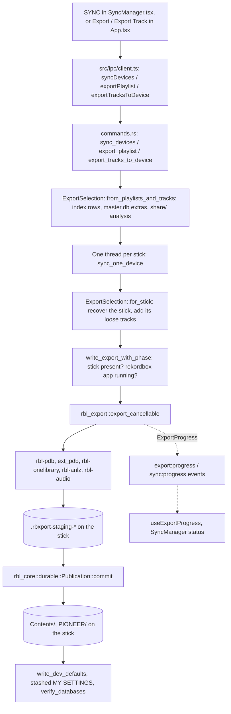
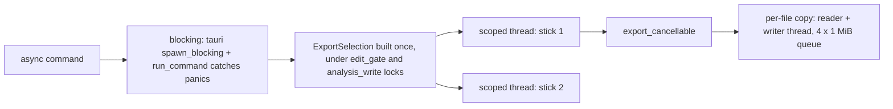
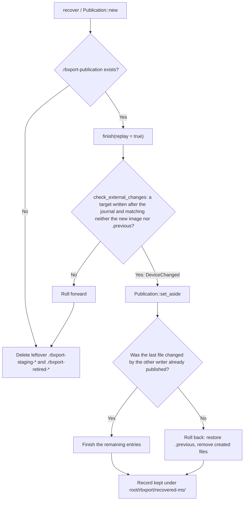

# How a USB export runs

[Documentation](../README.md) · [USB export format](usb-export-db.md) · [Export preferences](../user/usb-export.md)

This reference follows one USB export through the code, from the click in the
interface to the files on the stick. It is for engineers who are about to
change export or sync. It covers the order of the work, the reason for that
order, the safety checks, and where each step lives. The
[USB export format](usb-export-db.md) reference covers what the files contain.
This document links to it for format details and does not repeat them.

| Area | Code |
| --- | --- |
| Sync Manager window and progress | `src/views/sync/SyncManager.tsx`, `src/views/sync/SyncWindow.tsx`, `src/store/useExportProgress.ts`, `src/components/StopExport.tsx` |
| Main-window export (playlist, folder, Export Track, AppleScript) | `src/app/App.tsx` (`writeToDevice`, `exportTrackTo`) |
| IPC boundary | `src/ipc/client.ts`, `src/ipc/types.ts`, `src/ipc/backend-mock.ts` |
| Tauri commands and the export selection | `src-tauri/src/commands.rs`, `src-tauri/src/sync_window.rs` |
| Stick defaults written after an export | `src-tauri/src/device_settings.rs` |
| Orchestration | `crates/rbl-export/src/lib.rs` (`export_cancellable`) |
| Reconcile, conflict checks, verification | `crates/rbl-export/src/reconcile.rs`, `snapshot.rs`, `verification.rs` |
| Incremental-sync record | `crates/rbl-export/src/manifest.rs`, `sync_record.rs` |
| Staging, publication journal, recovery | `crates/rbl-core/src/durable.rs` (`Publication`) |
| Format writers | `rbl-pdb` (`export.pdb`), `rbl-export/src/ext_pdb.rs` (`exportExt.pdb`), `rbl-onelibrary` (`exportLibrary.db`), `rbl-anlz` (analysis), `rbl-audio` (conversion) |
| Drives | `crates/rbl-devices/src/lib.rs`, `mounts.rs`, `eject.rs` |

## Contents

1. [The mental model](#1-the-mental-model)
2. [Frontend](#2-frontend)
3. [Tauri layer](#3-tauri-layer)
4. [The rbl-export pipeline](#4-the-rbl-export-pipeline)
5. [Devices and the filesystem](#5-devices-and-the-filesystem)
6. [Failure modes and guarantees](#6-failure-modes-and-guarantees)
7. [Testing](#7-testing)
8. [Where to start when changing something](#8-where-to-start-when-changing-something)
9. [Glossary](#9-glossary)

## 1. The mental model

An export takes a selection from the rekordbox library and writes it to a
mounted volume as a player library. A selection is a set of playlists,
intelligent playlists, and folders, plus any tracks exported on their own.
The result has the audio under `Contents/`, analysis files under
`PIONEER/USBANLZ/`, artwork, and two library databases under
`PIONEER/rekordbox/`: the DeviceSQL `export.pdb` and the SQLCipher
`exportLibrary.db`. The [directory tree](usb-export-db.md#2-directory-tree)
lists every file.

**Export** and **sync** use the same code. The first export to a stick writes
everything. Each later export to the same stick is a sync. It reads the
manifest that the previous run left at `PIONEER/rbxport/manifest.json`. Audio
that has not changed is reused, files that changed are copied again, and files
that are no longer selected are removed. Player-facing ids stay the same
between syncs. If the manifest is missing, unreadable, or from a different
`MANIFEST_VERSION`, the export writes everything again.

**Inputs.** The in-memory library index (`rbl_index::Library`) and a few
values read from `master.db` through `rbl_db::export_info`: cues, extra
metadata, My Tags, `DBID`, and alternate file paths. The analysis files come
from the library's `share/` tree, and the audio from where the library keeps
it. The export never writes to the library.

**Outputs.** New and changed files are written to a staging directory on the
stick. They are checked, then published together through a journal, so an
interrupted run can be completed or rolled back by the next one. The stick's
existing playlists that this app did not write, the player's play history, My
Tags, and settings are read first and carried into the new databases.

## 2. Frontend

### Where an export starts

| Entry point | Code | IPC call |
| --- | --- | --- |
| Sync Manager SYNC (right-hand button) | `SyncManager` `sync` callback | `syncDevices(playlists, destinations, stickDefaults, false, ejectAfterSync, deleteUnlistedMusic, compatibilityFormat)` |
| Export a playlist or folder from the tree's context menu, the device panel, or AppleScript's `export` | `App.tsx` `exportPlaylist` → `writeToDevice` (also `syncToDevice` and the `export` script handler) | `exportPlaylist(playlistId, path, stickDefaults, deleteUnlistedMusic, compatibilityFormat)` |
| Export Track (track table, sub-browser, player deck) | `App.tsx` `exportTrackTo` | `exportTracksToDevice(ids, path, stickDefaults, compatibilityFormat)` |

All three read export options from `usePreferences()`:
`preferences.djSystem` is passed as stick defaults, and
`preferences.usbExport` provides `deleteUnlistedMusic`,
`maximumCompatibility`, and `conversionFormat`. The
[user guide](../user/usb-export.md) explains what each one does.

The Sync Manager's `open_sync_window` call opens it in a separate window. It
loads the same bundle at `index.html#sync`, and `SyncWindow.tsx` renders it.
The browser build has no separate windows, so `openSyncWindow` returns
`false` and `App.tsx` draws the manager over the main window. Both windows
read preferences from the same `localStorage`.

### What the Sync Manager does on SYNC

The `sync` callback in `SyncManager.tsx` runs these steps in order:

1. `refreshDevices()` reads `listDevices` again. Ticked sticks that are no
   longer mounted are dropped, so a stale `/Volumes/<name>` path is never
   sent.
2. `librarySummary()` reads `readOnly` again. If rekordbox is running, the
   sync stops and shows "Quit rekordbox to enable synchronization." The same
   value is polled every 2 s to enable or disable the SYNC button.
3. `validateExportFiles(playlists)` lists selected tracks whose audio file is
   missing. If any are found, `backend.confirm` asks whether to continue.
   Those tracks are then skipped.
4. If the History or Settings import preference is on, `importUsb` runs once
   per stick. This brings back play history and CDJ settings before the
   export replaces them.
5. The callback subscribes to `onSyncProgress` and calls `syncDevices`. The
   result is one `SyncDeviceReport` per stick, each with either `report` or
   `error`, plus the eject result.
6. It refreshes the device list and calls `deviceSyncState` for each stick
   that was not ejected.

When a stick is ticked, `readDevice` calls `deviceSyncState`. That command
reads the stick's manifest, or rekordbox's `playlists3.sync` if there is no
manifest, and re-ticks the playlists the stick was last synced with.

### Progress, cancellation, and errors

- **Per-stage progress.** `useExportProgress` (`src/store/useExportProgress.ts`)
  subscribes to `export:progress`. On mount it also reads `exportProgress()`,
  so a window that opens mid-export still shows the current state. Jobs are
  keyed by mount path, and a new `preparing` event starts a new batch. The
  states are `preparing`, `checking`, `copying`, `database`, `verifying`,
  `publishing`, `ejecting`, `done`, `failed`, and `cancelled`.
  `exportPercent` caps progress at 99% until the state is `done`.
- **Per-stick status line.** `sync:progress` (`SyncProgress`: `writing`,
  `ejecting`, `done`, or `failed`) drives the Sync Manager's one-line status.
- **Stop.** `StopExport` calls `cancelExport(path)`. The Sync Manager shows
  Stop only in the `preparing`, `checking`, `copying`, and `database` states.
  Those are the points where the backend still checks for cancellation; see
  [cancel](#on-cancel).
- **Errors.** A failed command rejects with a plain `{ kind, message, detail }`
  object (`AppError`). `src/lib/errorMessage.ts` turns that into text.
  `sync_devices` does not reject when one stick fails. That stick's report
  carries `error`, built with `AppError::full_message` so the detail is
  included. A cancelled export has `kind: "cancelled"` and the message
  "Export stopped.".

The browser mock (`src/ipc/backend-mock.ts`) implements the same calls with
in-memory sticks. It emits `export:progress` and `sync:progress` and honors
`cancelExport`, so Vitest and Playwright can drive the whole UI flow.

## 3. Tauri layer

### Commands

| Command | Does |
| --- | --- |
| `sync_devices` | Builds one `ExportSelection`, then writes it to every destination at the same time, each on its own scoped thread (`std::thread::scope`). One stick failing does not stop the others. Only building the selection can fail the whole call. Returns `Vec<SyncDeviceReportDto>`. |
| `export_playlist` | Selection for one playlist id (a folder expands to everything under it), then `write_export_with_progress`. Emits `export:done`. |
| `export_tracks_to_device` | Loads the stick's manifest. Re-selects its recorded non-folder playlists and the loose tracks recorded in `Manifest::loose`, adds the requested tracks as loose, then writes. Emits `export:done`. |
| `validate_export_files` | Builds the selection and returns tracks whose `source_path` is not a file. |
| `device_sync_state` | Reads the manifest, or `sync_record::read` if there is none, plus the stick's `export.pdb` playlist names and both library trees. Read-only. |
| `list_devices` | `rbl_devices::list()` plus `rbl_devices::inspect()` per volume. |
| `cancel_export` / `export_progress` | Set the cancel flag for a path, or return the progress map. |
| `eject_device` | `rbl_devices::eject::eject`; see [eject](#eject). |
| `open_sync_window` | `src-tauri/src/sync_window.rs`. |

All of these are registered in `src-tauri/src/lib.rs` (`generate_handler!`).

Export to a single playlist **replaces** the stick's selection. It does not
add to it. `export_playlist` builds a selection containing only that playlist
(plus the stick's recorded loose tracks), and the pipeline removes the
playlists and tracks this app wrote before that are not in the new selection
(see [reconcile](#step-by-step)). Playlists the app did not write stay on the
stick. `export_tracks_to_device` is the only path that merges with the
previous selection.

### Thread model

- `blocking` in `commands.rs` runs the work on Tauri's blocking pool through
  `error::run_command`, which turns a panic into an `AppError`. No panic
  crosses IPC.
- `ExportSelection::from_playlists_and_tracks` holds `state.edit_gate` and
  `state.analysis_write` while it reads, so a library edit or analysis write
  cannot happen in the middle of building a selection. The locks are dropped
  before any stick is written.
- `copy_data_with_durability` in `rbl-export` copies each file with a reader
  and a writer thread connected by a bounded channel (`COPY_QUEUE` = 4,
  `COPY_BUFFER` = 1 MiB), so the source read and the USB write overlap. It
  writes data only, so macOS does not create `._` AppleDouble files on FAT.

### Building the selection

`ExportSelection` (in `commands.rs`) holds `tracks: Vec<SourceTrack>`,
`playlists: Vec<SourcePlaylist>`, `my_tags`, and `sync: SyncSource`.

- Playlist ids are looked up in `library.playlists()`. A folder expands
  through `folder_contents`, which walks the tree iteratively so a cycle
  cannot loop forever. Intelligent playlists become
  `TrackSource::SmartPlaylist` and contain whatever their rule matches at
  that moment. Rows come from `library.source_rows`, which means rbl-index
  does the work.
- Each library row becomes one `SourceTrack`, however many playlists contain
  it. `source_track` fills the fields from the index. `source_audio` picks
  `FolderPath`, or else the first existing entry of `rb_LocalFolderPath` and
  `OrgFolderPath`. `read_analysis` reads `ANLZ0000.DAT/.EXT/.2EX` from
  `share/` and parses each one. A missing EXT or 2EX is allowed. A missing
  DAT, when the row has an analysis path, is an error.
- `cues` is always `Some(extra.cues)`, read from `djmdCue` through
  `rbl_db::export_info::track_extras`. Library cues therefore always replace
  the cue lists in the copied analysis files.
- Folders above every chosen playlist are added as `folder: true` playlists,
  placed before the playlists.
- `SyncSource` carries the library `DBID`, the whole playlist tree, and the
  "automatic" flag. The Sync Manager always passes `automatic: false`.

`for_stick` runs per destination. Unless "Delete music outside playlists" is
on, it calls `rbl_export::recover` on the stick and adds the loose tracks the
stick's manifest records (when the manifest's `db_id` matches). Note the
order: this recovery runs before the rekordbox check in the next step.

### `write_export_with_progress` and `write_export_with_phase`

`write_export_with_progress` handles jobs and events:

- It inserts an `AtomicBool` into `EXPORT_CANCEL`, keyed by mount path. A
  second export to the same path is refused with "An export to this device
  is already running." If no other job is running, it clears
  `EXPORT_PROGRESS` to start a new batch.
- It emits `export:progress` with `preparing`, then each `ExportProgress` the
  pipeline reports, then `done`, `failed`, or `cancelled`. Each event is also
  stored in `EXPORT_PROGRESS` for `export_progress()`.
- Errors pass through `disconnected_during_export`. If the export failed and
  the mount path is no longer a directory, the error becomes "The USB was
  disconnected during the sync. Plug it back in and sync again; the sync
  picks up from there." The filesystem's error is kept as the detail
  (commit `ed75e78`).

`write_export_with_phase` makes the calls:

1. Refuses if the destination is not a directory (`NotFound`).
2. Refuses if `rbl_db::is_rekordbox_app_running()` (`ReadOnly`). See the
   [rekordbox check](#rekordbox-running-checks).
3. Chooses the root for a blank volume:
   `ExportRoot::for_file_system(device.file_system)`, where HFS+ gives
   `.PIONEER`.
4. Reads which of `MYSETTING.DAT`, `MYSETTING2.DAT`, and `DJMMYSETTING.DAT`
   are absent from the stick, taking the replacement bytes from the settings
   stash (`usb_import::settings_stash`).
5. Calls `rbl_export::export_cancellable` with `ExportOptions { defaults,
   sync, compatibility, root }`. `ExportError::Cancelled` maps to
   `ErrorKind::Cancelled`. Every other export error maps to `Internal`, with
   the error text as the message.
6. After the export has been published:
   - `device_settings::write_dev_defaults` writes `DEVSETTING.DAT` from the
     DJ System defaults, only if the stick has none. It uses its own
     `Publication` through `rbl_devices::settings::write_changes`.
   - The stashed MY SETTINGS files from step 4 are written with
     `durable::write`. They replace any copies the export staged from
     rekordbox's settings directory.
   - `rbl_export::verify_databases` reads both databases back. The export
     fails if they disagree, or if the track count differs from
     `report.tracks`.

So the Tauri layer **does** create `DEVSETTING.DAT` on a stick that has none
when stick defaults are passed. The `rbl-export` crate itself never creates
it (see [Device settings creation](usb-export-db.md#device-settings-creation)).
These post-publish steps are separate writes. If one fails after the commit,
the stick already holds the new generation, and the error reports a
completed publication as a failure.

### Eject

`sync_one_device` ejects after a sync only if the report has `verified` set
and `skipped` empty. Otherwise it sets `eject_error`. `eject_device` holds
the `EXPORT_PROGRESS` lock while it ejects, so a new export cannot record
progress until the eject finishes. It refuses only when that path's job state
is `"writing"`. The export jobs stored in `EXPORT_PROGRESS` use the stage
names listed above and never `"writing"` (`"writing"` is a `sync:progress`
state), so as written this check does not match an export in progress. The
Sync Manager disables its eject buttons while any job is active.
`rbl_devices::eject` checks that the path is a real enumerated volume, then
runs `diskutil eject` (macOS) or `udisksctl unmount` (Linux).

## 4. The rbl-export pipeline

`export_cancellable` in `crates/rbl-export/src/lib.rs` is one linear function,
kept long on purpose ("splitting it would hide the order writes happen in").
`export`, `export_with`, `export_full`, and `export_with_options` are thin
wrappers that fill in defaults.

### Step by step

| # | Step | Code | Why here |
| --- | --- | --- | --- |
| 1 | Check `cancelled()`; refuse if the destination is not a directory. | top of `export_cancellable` | Cheap exits before any I/O. |
| 2 | Choose `PIONEER` or `.PIONEER`. | `export_root_name_with` | A stick with libraries under both roots is a `Conflict`; a blank stick takes the preferred root. See [Root selection](usb-export-db.md#root-selection). |
| 3 | Create `Contents/`, `<root>/USBANLZ/`, `<root>/rekordbox/` directly on the stick. | `rbl_core::durable::create_dir_all` | Directories only. Done even for an empty export. |
| 4 | Finish an interrupted publication. | `rbl_export::recover` | Nothing may read the stick while a previous run's journal is pending. See [recovery](#recovery-of-an-interrupted-publication). |
| 5 | Open the publication: take the exclusive lock, replay any journal, delete leftover stages, create `.rbxport-staging-*`. | `Publication::new` | All new files go into the stage. The lock (`.rbxport-write.lock`, `fs2` exclusive lock) is held until the end of the run. |
| 6 | Load the previous manifest. Read a `Snapshot` of both databases and an `analysis_stamp` of every analysis file they name. | `Manifest::load`, `snapshot::Snapshot::read`, `snapshot::analysis_stamp` | The "before" picture, used for reconciling now and for detecting other writers just before commit. |
| 7 | Upgrade an old manifest that has no `db_id`, if rekordbox's sync record names the same `DBID`. | inline | Old manifests lack the field. |
| 8 | Baseline checks. | `Snapshot::check_baseline` | Refuses a stick whose two libraries already disagree (first sync only), whose track identities rekordbox changed, or whose manifest belongs to another library (`db_id`). |
| 9 | Reconcile the selection with the stick. | `reconcile::prepare` | Links selected tracks to their existing device rows (`identify_tracks`) and playlists to their device ids (`identify_playlists`). Keeps what the selection does not name but the stick still needs (`retain_device_only`). |
| 10 | Merge the stick's My Tags into the library's. | inline | Tags that exist only on the stick are kept. |
| 11 | Assign ids: playlists first, then tracks. Check that ids are unique and playlist membership is valid. | `playlist_ids`, `assign_ids` | Ids are pinned to the previous manifest, so they stay the same between syncs ([why](usb-export-db.md#incremental-sync)). |
| 12 | Work out where each track goes: in place or copied, the path, and the collision suffix. | `previous_in_place`, `in_place_paths`, `layouts`, `layout` | Every path is decided before any file is written. |
| 13 | Refuse if a track that is already on the stick has lost its source file. | inline | "Source unavailable … the USB has not been changed." This stops a missing source from deleting a good copy on the stick. |
| 14 | Per track (below). | loop body | Produces the staged audio, analysis, and artwork, one `ManifestTrack`, one `OneLibraryTrack`, and one `track_row`. |
| 15 | Mark manifest entries that were not matched as obsolete. | `stale` map | Tracks that left the selection. Library files that live on the stick (`owns_library_file`) are never deleted. |
| 16 | Build playlist rows and entries. | `playlist_row`, `playlist_entry_row` | Must come after the tracks, because entries name export ids. A skipped track leaves no gap: positions stay dense. |
| 17 | Read the stick's existing `exportLibrary.db` settings. | `StickSettings::read` | Colour names, device name, and browse settings carry over. If none exist, `defaults` is used. |
| 18 | Check that every DeviceSQL row fits on one page. | `rbl_pdb::build::max_row_len` | Otherwise the page builder would truncate the row. Refused with a message naming the track, tag, or playlist. |
| 19 | Write staged `export.pdb`, then `exportExt.pdb`, then `exportLibrary.db`. | `build_pdb`, `ext_pdb::build`, `write_one_library` | See [DeviceSQL](usb-export-db.md#4-exportpdb--the-devicesql-database), [My Tags](usb-export-db.md#5-exportextpdb--my-tags), [OneLibrary](usb-export-db.md#6-exportlibrarydb--the-onelibrary-database). |
| 20 | Stage MY SETTINGS from rekordbox's settings directory, only for files absent from the stick. | `MY_SETTINGS_FILES`, `rbl_core::paths::rekordbox_settings_dir` | See [My Settings preservation](usb-export-db.md#my-settings-preservation). |
| 21 | Stage `playlists3.sync` and `playlists3Plus.sync`. | `sync_record::render_with_ids` | Only when `sync` is passed. First-tick timestamps are kept from the stick's previous record. |
| 22 | Read the staged databases back and check them against the "before" snapshot. | `Snapshot::read_at(stage)`, `check_retained_history`, `check_changes` | Refuses if the run would drop history tracks, My Tag edits, or OneLibrary cue edits made on the stick. |
| 23 | Verify the staged generation. | `verification::verify_staged` | Both databases are present and agree, ids are unique, referenced files exist (stage first, then the stick), analysis parses, the playlist tree is valid. On failure: "The export did not verify, so the USB was left as it was". |
| 24 | Write the manifest into the stage, with `baseline` = the staged snapshot. | `Manifest::save_at` | Written last into the stage. Published together with everything else. |
| 25 | List the staged files. Add removals for `exportLibrary.db-wal`/`-shm` and for analysis extensions that are no longer exported. | `staged_files` | Names are mapped to NFC so they match the database paths ([why](#filesystems)). |
| 26 | Read the stick's databases and analysis stamp again, and compare with step 6. | `Snapshot::read` + `analysis_stamp` | "The device changed during sync. Close other writers and retry." This catches rekordbox or a player writing during staging. |
| 27 | Last cancellation check, then report `publishing`. | `cancelled()` | After this point the run is not cancellable. |
| 28 | Commit. | `Publication::commit` | [Publication](#publication). |
| 29 | Remove obsolete audio and analysis directories that the new manifest does not keep. | `remove_under` | After commit, so a failed run never deletes anything. Best effort: errors are ignored. |

Progress stages reported by the pipeline: `checking` (once per track, before
the track is handled), `copying` (only when a track is actually written),
`database`, `verifying`, and `publishing`.

### Reconcile: what is kept, replaced, or removed

`reconcile::prepare` returns an expanded track and playlist list:

- **Selected tracks** that are already on the stick get `device:
  Some(DeviceTrack { preserve: false, .. })`. They keep their export id and
  are rewritten.
- **Device-only playlists** are playlists on the stick that this app did not
  write (not owned according to the manifest, or according to the sync
  record if there is no manifest). They are added with `device_only: true`,
  id `DEVICE_PLAYLIST_ID_BASE` (`1 << 63`) + their device id, and their
  folders.
- **Tracks the stick still needs** are added with `preserve: true`: tracks
  in device-only playlists, tracks in play history, and tracks another
  writer put on the stick. Their metadata is read back from
  `exportLibrary.db` (`sources_from_one`) or `export.pdb`
  (`sources_from_legacy`). Their audio and analysis stay exactly as they are,
  and conversion is skipped.
- If neither database exists, reconcile does nothing (`merged_library` returns
  `None`).

### Per track

In loop order:

1. `publication.check_root()` confirms the mount's device and inode have not
   changed (Unix only; a no-op on Windows). Then progress `checking`, then a
   cancellation check.
2. `metadata(source)`: if the file is not found, the track is added to
   `report.skipped` and the loop moves on. `ENXIO`, `ENODEV`, or `EIO`
   becomes `DeviceGone`.
3. **Conversion.** `compatibility` is set and
   `rbl_audio::compatibility::needs_conversion` returns true. The file is
   renamed `{stem}-rbx-cdj-{export_id}.{ext}`. Preserved device tracks are
   never converted.
4. **Analysis directory.** `analysis_directory(audio, root)` is the CDJ
   firmware path hash ([§3](usb-export-db.md#3-audio-files),
   [collisions](usb-export-db.md#analysis-path-collisions)). On a collision
   the file name gets a suffix and the hash is computed again. A duplicate
   audio path is a `Conflict`.
5. **Reuse or copy.**
   - *In place*: the library's own file is already on the stick
     (`on_stick`). The databases point at it, nothing is copied, and it is
     not hashed.
   - *Unchanged*: same path, same source size and nanosecond mtime, and same
     conversion profile. The stick's copy then matches the recorded
     `audio_hash`, and for unconverted files the source hash matches too.
     Manifests without `audio_hash` fall back to `files_equal`. See
     [Incremental sync](usb-export-db.md#incremental-sync).
   - *Otherwise*: `copy_staged`, or `compatibility::convert`, into the
     stage. `copying` is reported.
6. If the track moved (for example, the artist was renamed), the old audio
   path and analysis directory go on the `obsolete` list. `same_file` stops a
   case-only rename on FAT or macOS from deleting the new copy.
7. **Analysis re-emission.** Preserved tracks are skipped. For each source
   DAT/EXT/2EX the code parses it, replaces `PPTH` with the stick path,
   inserts an empty `PVBR` into a DAT that has none, applies the export
   phrase mask, and replaces the DAT and EXT cue lists with the library cues
   (`rbl_anlz::cues::sections`). See
   [Analysis export transformation](usb-export-db.md#analysis-export-transformation)
   and [Source cue export](usb-export-db.md#source-cue-export).
8. `snapshot::check_analysis`: if the stick's analysis files changed since
   the last sync in their cue or beat-grid sections, the run is refused ("USB
   cues or beat grids changed since the last sync"). A missing companion file
   can be repaired. A changed one may be an edit made on the player.
9. Analysis is staged only if the hash or directory changed, or the bytes on
   the stick differ. Companions that the library no longer has are queued
   for removal.
10. **Artwork.** `write_artwork` stages up to four files per image: one
    interned id per source image, 20 images per folder. Files already on the
    stick at the same bytes are skipped. See [§8](usb-export-db.md#8-artwork).
11. The `ManifestTrack`, `OneLibraryTrack`, and `track_row` are created from
    the same values, so the two databases cannot disagree on a path or size.

### What is written, reused, and deleted

| Thing | Fresh stick | Later sync |
| --- | --- | --- |
| Audio of a selected track | Copied or converted into the stage | Reused if unchanged; copied again if changed or missing; left alone if in place |
| Audio of a track that left the selection | — | Removed after commit, unless it is the library's own file on the stick or still needed by device playlists or history |
| Audio of device-only and history tracks | — | Kept as is |
| Analysis | Re-emitted for every track that has it | Rewritten only if changed; missing companions repaired |
| Artwork | Four files per image | Skipped if the same bytes are already there |
| `export.pdb`, `exportExt.pdb`, `exportLibrary.db` | Built | Always rebuilt from scratch, carrying device-only rows, history, tags, settings, and cues |
| MY SETTINGS files | Copied if absent | Never overwritten by `rbl-export` |
| Sync record | Written | Rewritten, keeping first-tick timestamps |
| `PIONEER/rbxport/manifest.json` | Written | Rewritten |

### `create_library_with_root`

`create_library_with_root`, which the device panel calls through
`ensure_device_library`, gives a blank stick empty databases the way
rekordbox does when a drive connects. If only one of the two databases
exists, it converts the stick by running a full export of what it reads
there (`reconcile::all`). It never publishes an empty database next to a
populated one.

## 5. Devices and the filesystem

### Detecting drives

- `rbl_devices::list` enumerates volumes with `sysinfo`. `is_offerable`
  accepts any removable disk, plus `/Volumes/*`, `/media`, `/run/media`,
  `/mnt`, and non-`C:` drive letters, because external SSDs often report
  that they are not removable. On macOS, `filesystem_name` turns `msdos`
  into `FAT32` (or the specific FAT variant).
- `rbl_devices::inspect` reads the manifest first and parses `export.pdb`
  only when there is no manifest. It is called once per device when the panel
  asks, never on a timer, and it never recovers a journal.
- `MountWatcher` (`mounts.rs`) checks the mounted set every 2 s (`INTERVAL`).
  `src-tauri/src/lib.rs` emits `devices:changed` when the set changes, and
  the Sync Manager refreshes on that event.
- `RB_LITE_FAKE_VOLUMES` (`rbl_devices::FAKE_VOLUMES`) replaces real volumes
  with a `:`-separated list of directories, for tests and development.

### Filesystems

No code path branches on FAT32 versus exFAT. What the code does:

| Concern | Handling |
| --- | --- |
| Names | `fat_safe` normalizes to NFC and replaces `/ \ : * ? " < > |` and control characters. `dir_name` cuts at 48 characters; `fat_file_name` at 120 bytes, keeping the extension. Path comparisons use `path_key` (NFC + lowercase). |
| macOS FAT32/exFAT drivers list names in NFD | `staged_files` maps each listed name back to the NFC name the databases use. `durable::rename` and `remove_tree` retry with the other normalization form (`name_forms`, `in_stored_form`). [OBS 2026-10-08, from the comments in `durable.rs`] |
| No exclusive rename (FAT32 msdosfs, exFAT on macOS 26) | `durable::persist_new` checks that the target is absent, then does a plain rename. |
| AppleDouble `._` files | Data-only copies; `Publication::commit` and `finish` skip `._` paths. |
| FAT time resolution and time zone | `published_at` adds 2 s of grace. A run's own commit skips the external-change check entirely (see below). |
| HFS+ | `ExportRoot::for_file_system` chooses `.PIONEER` on a blank volume [OBS, as recorded in [Root selection](usb-export-db.md#root-selection)]. |
| Large files | The DeviceSQL file size is clamped to `u32::MAX`. No check before copying for FAT32's 4 GiB file limit or for free space was found in this code path. A failed write appears as a copy error during staging. |

### rekordbox-running checks

`rbl-db` has two process checks (`crates/rbl-db/src/lib.rs`):

- `is_rekordbox_running()` checks for the `rekordbox` app **or**
  `rekordboxAgent`. Writes to the library itself wait for both, because the
  agent syncs the library.
- `is_rekordbox_app_running()` checks for the app only. USB writes (sync,
  export, and stick playlist edits in `device_library.rs`) use this check.
  Its comment records that rekordbox rewrote a stick's databases within a
  minute of seeing the stick, while the agent changed no file on a stick
  [OBS 2026-10-09, rekordbox 7.2.14, Windows 11, #122] (commit `ca22b2a`).

The Sync Manager's SYNC button is controlled by `librarySummary().readOnly`.
For a real install, `library_summary` computes that value with
`is_rekordbox_running()`, which includes the agent. The backend accepts a
sync while only the agent runs, but the Sync Manager's button may still be
disabled in that case. This has not been checked at runtime.

### Safeguards from recent fixes

| Commit | Problem | Safeguard in the code |
| --- | --- | --- |
| `ed75e78` | A stick pulled mid-sync showed raw OS errors. | `disconnected_during_export` rewrites the error when the mount is gone. The next sync recovers the journal. Test: `a_stick_pulled_during_a_sync_is_reported_as_disconnected` (`src-tauri/tests/commands.rs`). |
| `ca22b2a` | `rekordboxAgent` blocked every USB sync. | USB guards use `is_rekordbox_app_running`; the refusal is `ErrorKind::ReadOnly`, not internal. |
| `a160112` | After an interrupted sync, rekordbox rewrote the databases, and recovery refused the stick until it was reformatted (#229). | `rbl_export::recover` catches `DeviceChanged` and calls `Publication::set_aside`. See [recovery](#recovery-of-an-interrupted-publication). Tests: `crates/rbl-export/tests/recovery.rs`. |
| `5f27bce` | A stick written by a clock ahead of this machine failed at "Publishing" (FAT stores local time with no zone). | `Publication::commit` calls `finish(.., replay: false)`, which skips `check_external_changes`. The check runs only when replaying a journal left by an earlier run. Test: `a_stick_whose_files_look_newer_than_this_clock_still_syncs`. |
| `1aab64b`, `90f5834` | Music the library keeps on the stick was copied again, or deleted later. | `on_stick`, `in_place`, `owns_library_file`. Tests: `crates/rbl-export/tests/on_stick.rs`. |

## 6. Failure modes and guarantees

### Publication

`rbl_core::durable::Publication` is the only way export files reach their
final names on the stick.

1. `commit` checks the root's device and inode and validates the relative
   paths. It flushes every staged file, then every staged directory (children
   before parents).
2. It writes `publication.json`, listing each path, whether a new image
   exists, and whether a target existed. It renames the stage to
   `.rbxport-publication` (the journal) and flushes the root.
3. `finish` goes through the entries in order. It moves each existing target
   into `.rbxport-publication/.previous/` and renames the new image into
   place, flushing the parent directory after each step. An entry with no
   image means "delete": the target moves to `.previous`.
4. It renames the journal to `.rbxport-retired-*`, flushes the root, and then
   deletes it.

Each file replacement is a rename within one filesystem, so it is atomic, and
audio is never copied a second time. The **set of files** is not atomic as a
filesystem transaction. It is made safe by the journal: until the journal is
retired, the next run completes it. The format reference states the same
limit under [Staging and publication](usb-export-db.md#staging-and-publication).

### Recovery of an interrupted publication

`set_aside` leaves the other writer's files as it wrote them. It keeps a
`-wal` or `-shm` file only when the database next to it also belongs to the
other writer. The stick's earlier versions go to `keep/previous` and files it
had to move go to `keep/theirs`. If a new image is lost during replay, the
journal is marked `.incomplete` and an error is returned. A lost image is
never treated as a deletion.

### On cancel

Cancellation is checked at the start, once per track, and immediately before
commit. A cancelled run returns `ExportError::Cancelled`. Dropping
`Publication` deletes the stage (`impl Drop`). The stick keeps its previous
generation. What may remain: the directories created in step 3, the
`.rbxport-write.lock` file, and the result of any recovery that ran at the
start. Once `publishing` is reported, the run cannot be cancelled.

### On unplug

- During staging: `check_root`, `is_device_gone`, or an ordinary I/O error
  fails the run. The previous generation on the stick is untouched, and a
  partial stage may be left. The next `Publication::new` deletes it.
- During commit: the journal remains on the stick. The next export, import,
  settings write, or `verify` call recovers it first.
- In both cases the Tauri layer reports "The USB was disconnected during the
  sync".

### On crash

The same as an unplug: a stage is deleted later, and a journal is recovered
later. A crash after commit but before obsolete-file removal leaves files that
the new manifest no longer names. No later step was found that removes them.

### On disk full

There is no free-space check before staging, and commit needs no extra space
because it only renames. A full stick fails a staged write. The run returns
an I/O error with context ("Could not copy '…' to the USB"), and the stage is
dropped. The Sync Manager's failure text suggests checking free space.

### Conflicts that leave the stick unchanged

Each of these returns `ExportError::Conflict` before commit, so the stick
stays as it was:

| Message starts with | Raised by |
| --- | --- |
| "Both PIONEER and .PIONEER contain libraries" | `export_root_name_with` |
| "The two existing device libraries disagree" | `Snapshot::check_baseline` (first sync) |
| "rekordbox changed the device track identities" | `Snapshot::check_baseline` |
| "This USB belongs to a different or older unverified master library" | `Snapshot::check_baseline` |
| "Device playlist/history references missing track" | `reconcile::retain_device_only` |
| "Duplicate source playlist ID", "Ambiguous playlist identity", "Missing parent folder for" | `playlist_ids` |
| "Source unavailable for '…'" | step 13 |
| "Conversion would create duplicate audio path", "Analysis directory space exhausted" | per-track loop |
| "USB cues or beat grids changed since the last sync" | `snapshot::check_analysis` |
| "… longer than export.pdb can hold" | row-length checks |
| "A track being removed is still referenced by USB history" | `Snapshot::check_retained_history` |
| "My Tag '…' changed on the USB", "OneLibrary contains cue records…" | `Snapshot::check_changes` |
| "The export did not verify, so the USB was left as it was" | `verify_staged` |
| "The device changed during sync. Close other writers and retry." | step 26 |

`ExportError` displays a conflict as `USB sync conflict: <message>`.

### Errors after commit

"The USB did not verify after the sync: …" comes from `verify_databases`
in `write_export_with_phase`, after publication. Errors from
`write_dev_defaults` or the stashed settings writes also come after commit.
In these cases the new generation is already on the stick.

## 7. Testing

Never point a test, example, or manual check at a real rekordbox library or a
mounted volume. Use a temporary directory as the stick.

### Automated

| Suite | What it covers | Run |
| --- | --- | --- |
| `crates/rbl-export/tests/export.rs` | A full export read back the way a player would: layout, metadata, HFS root, FAT names, artwork, My Tags, conversion, cues, collisions, row size limits | `RB_LITE_TEST=1 cargo test -p rbl-export --test export` |
| `tests/sync.rs` | A second export to the same stick: reuse, recopy, removal, stable ids, renames, repair | `--test sync` |
| `tests/safety.rs` | Cancel, missing source, conflicts, retained device-only content, late external edits | `--test safety` |
| `tests/recovery.rs` | Interrupted publication, rekordbox writes during recovery (#229), clock skew | `--test recovery` |
| `tests/on_stick.rs` | Library files that already live on the stick | `--test on_stick` |
| `tests/removable_media.rs` | Real FAT32/exFAT disk images through `hdiutil`. Skipped where `hdiutil` cannot attach an image. | `--test removable_media` |
| `tests/device_library.rs` | Editing a stick's playlists | `--test device_library` |
| `tests/pipeline.rs` | Analyse generated audio, author analysis, export, verify | `--test pipeline` |
| `rbl-core` `durable` unit tests | Journal replay, set-aside, NFC/NFD, no exclusive rename | `RB_LITE_TEST=1 cargo test -p rbl-core` |
| `src-tauri/tests/commands.rs` | The real commands against `rbl_db::fixture::build` libraries: preflight, Export Track, multi-stick sync, folders, intelligent playlists, a pulled stick | `RB_LITE_TEST=1 cargo test -p rbxport --test commands` |
| `src/views/sync/SyncManager.test.tsx` | Sync Manager behavior on the mock backend | `pnpm test` |
| `e2e/sync-manager.spec.ts`, `e2e/sync-production.spec.ts` | Sync Manager in Chromium/WebKit on the mock backend, and the built window at `#sync` | `pnpm e2e` |

`RB_LITE_TEST=1` (or `RBXPORT_TEST`) makes `rbl-db` refuse to open the
installed library read-write. `rbl_db::fixture::build(dir, shape)` creates a
throwaway encrypted library with the real schema. `src-tauri/tests/commands.rs`
builds its `shell()` this way. The `rbl-export` tests build `SourceTrack`
values directly and do not need a library.

Before handing off, run the checks in [Testing](../development/testing.md#before-review).

### Tools

- `rbl-difftool` captures a `master.db` snapshot before and after one action
  in rekordbox, and diffs them. Use it to find out what rekordbox changes in
  the library. It reads library databases, not stick files.
- `rbl-fakecdj` is a client for the PRO DJ LINK RemoteDB and NFS servers. It
  tests LINK, not USB export.
- `cargo run -p rbl-export --example real -- [count] [dest]` exports real
  tracks from the installed library, opened read-only. The default
  destination is a temporary directory. Keep it that way.
- `cargo run -p rbl-export --example xdj_az_fixture -- <empty dir>` builds a
  small export from a generated WAV for the private XDJ-AZ emulator suite.

### Checking an export by hand

1. Run `pnpm dev:web` to drive the UI against the mock backend. This writes
   no files.
2. For real files, export to a temporary directory: an `rbl-export` test, the
   `real` example, or `RB_LITE_FAKE_VOLUMES=/tmp/stick` with a fixture
   library.
3. Read the result back with `rbl_export::verify(destination)`. It recovers
   first, then runs the staged checks plus the manifest's companion checks.
4. Compare against a rekordbox export using the method in
   [Verifying the result](usb-export-db.md#11-verifying-the-result). Byte
   comparison is only meaningful under the limits listed there. Testing on a
   player or emulator is a separate result
   ([testing guide](../development/testing.md)).

## 8. Where to start when changing something

| To change | Start in | Also touch |
| --- | --- | --- |
| A track field written to both databases | `SourceTrack` (`rbl-export/src/lib.rs`); `source_track` (`commands.rs`), or `rbl_db::export_info::track_extras` if the index lacks it | `rbl_pdb::rows::TrackInput` / `track_row`; `OneLibraryTrack` and `add_tracks` → `rbl_onelibrary::build::Track`; `reconcile::sources_from_one/legacy` for retained tracks; `snapshot::Track` if verification or conflict checks should compare it; the [metadata table](usb-export-db.md#metadata-and-cue-mapping) |
| Which tracks or playlists a selection contains | `ExportSelection::from_playlists_and_tracks`, `folder_contents`, `for_stick` | `SyncManager.tsx` ticking (`tickNode`, `playlistsUnder`); `src-tauri/tests/commands.rs` |
| Playlist rows, order, or folders on the stick | Playlist loop in `export_cancellable`; `playlist_ids` | `write_one_library` (`add_playlist_node`); `reconcile::retain_device_only`; `verify_staged` |
| Reuse versus copy rules | The "unchanged" block in the per-track loop | `ManifestTrack` fields (bump `MANIFEST_VERSION` if a field changes meaning); `tests/sync.rs` |
| File names or layout | `layout`, `layouts`, `fat_safe`, `fat_file_name`, `dir_name`, `analysis_directory` | `staged_files`; `tests/export.rs`; [Audio naming](usb-export-db.md#audio-naming-and-conversion) |
| Analysis written to the stick | The `exported_analysis` block | `rbl-anlz`; `snapshot::check_analysis` |
| Cue export | `rbl_db::export_info` (cues), `rbl_anlz::cues::sections` | `rbl_onelibrary::build::Builder::replace_cues` / `preserve_cues` |
| Artwork | `artwork_path`, `write_artwork` | `artwork_row`; `Builder::add_image` |
| Format conversion | `rbl_audio::compatibility` | Conversion naming in the per-track loop; [user guide](../user/usb-export.md#maximum-cdj-compatibility) |
| What counts as a conflict | `snapshot.rs` (`check_*`), `reconcile.rs` | `tests/safety.rs` |
| Publication or recovery | `rbl_core::durable::Publication`, `rbl_export::recover` | `tests/recovery.rs`, `tests/removable_media.rs`, `durable.rs` unit tests |
| Progress, cancel, or error text | `write_export_with_progress`, `disconnected_during_export`, `sync_one_device` | `useExportProgress`, `StopExport`, `SyncManager.tsx`, `src/ipc/types.ts` (`ExportProgress`), `backend-mock.ts` |
| Device list, watcher, or eject | `rbl_devices::list`, `inspect`, `MountWatcher`, `eject` | `list_devices`, `eject_device`; `devices:changed` in `src-tauri/src/lib.rs` |
| Stick defaults (DJ System) | `device_settings::write_dev_defaults`, `library_defaults` | `StickSettings`; [Device and DJ settings](usb-export-db.md#9-device-and-dj-settings) |
| Editing a stick's playlists | `rbl_export::device_library` | `src-tauri/src/device_library.rs`; [Device playlist edits](usb-export-db.md#device-playlist-edits) |
| A new export IPC command | `commands.rs`, registered in `src-tauri/src/lib.rs` | `src/ipc/client.ts`, `types.ts`, `backend-mock.ts` (views never call `invoke`) |
| A failed sync in a user log | The `"sync to one device failed"` warning in `sync_one_device` (fields `destination`, `error`, `detail`) and the `"settled an interrupted export…"` warning in `rbl_export::recover` | Match the message to the [conflict table](#conflicts-that-leave-the-stick-unchanged); look for `.rbxport-publication`, `.rbxport-staging-*`, or `rbxport/recovered-*` on the stick. Log locations are in [Debugging](../development/debugging.md#logs). |

## 9. Glossary

| Term | Meaning |
| --- | --- |
| Export / sync | The same pipeline. A sync is an export to a stick that has this app's manifest. |
| Selection | `ExportSelection`: tracks, playlists by track index, My Tags, `SyncSource`. |
| Device Library | rekordbox's name for the `export.pdb` library on a stick. |
| PDB / DeviceSQL | The paged binary database format of `export.pdb` and `exportExt.pdb`. See [§4](usb-export-db.md#4-exportpdb--the-devicesql-database). |
| `exportExt.pdb` | The second DeviceSQL file, holding My Tags. See [§5](usb-export-db.md#5-exportextpdb--my-tags). |
| OneLibrary | `exportLibrary.db`, the SQLCipher library that rekordbox 7's device panel reads (rekordbox also calls it Device Library Plus). See [§6](usb-export-db.md#6-exportlibrarydb--the-onelibrary-database). |
| ANLZ / analysis bundle | `ANLZ0000.DAT`, `.EXT`, and `.2EX` under `USBANLZ/P###/########/`: beat grid, cues, waveforms, phrases. See [§7](usb-export-db.md#7-the-analysis-bundle). |
| DAT / EXT / 2EX | The three analysis files. DAT holds the grid, legacy cues, and preview waveform. EXT holds extended cues and detail waveforms. 2EX holds the CDJ-3000 three-band waveforms. |
| `PPTH` | The analysis section that names the audio path. Rewritten for every export. |
| My Tags | The library's user tag categories and tags (`djmdMyTag`), written to `exportExt.pdb` and `exportLibrary.db`. |
| My Settings | `MYSETTING.DAT`, `MYSETTING2.DAT`, `DJMMYSETTING.DAT`, `djprofile.nxs`: the DJ's player and mixer settings. |
| `DEVSETTING.DAT` | Player display preferences. Created by the Tauri layer or the device panel, never by `rbl-export`. |
| Sync record | `playlists3.sync` and `playlists3Plus.sync`: rekordbox's record of the source library and the ticked playlists. See [§10](usb-export-db.md#10-sync-records). |
| Manifest | `PIONEER/rbxport/manifest.json`: this app's record of what it wrote, the ids, the hashes, and the baseline snapshot. |
| Baseline | The `Snapshot` saved in the manifest, used to tell edits made on the stick from this app's own writes. |
| Export id | A track's id on the stick (`content_id`). Pinned across syncs. |
| Track key | `track_key(library_id, source)`: `#<id>`, or the source path when the id is 0. |
| Device-only | A playlist on the stick that this app did not write. Kept, with ids from `1 << 63`. |
| Preserved track | `DeviceTrack { preserve: true }`: kept on the stick as is, for device-only playlists, history, or another writer's files. |
| Loose track | A track in no playlist, put on the stick by Export Track (`Manifest::loose`). |
| In place | A library file that already lives on the stick. It is pointed at, never copied, moved, or deleted. |
| Stage | `.rbxport-staging-*`: where a run writes new files before commit. |
| Journal | `.rbxport-publication/` with `publication.json`: commit intent that recovery completes. |
| `DBID` | `djmdProperty.DBID` of the source library, stored in the manifest and the sync record. |
| Root | `PIONEER/`, or `.PIONEER/` (hidden, chosen for blank HFS+ volumes). |
